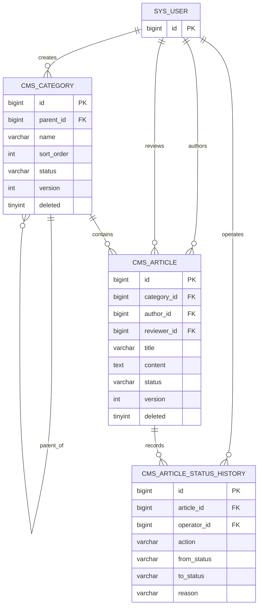

# enterprise-cms A 模块数据库设计

| 项目 | 内容 |
| --- | --- |
| 文档版本 | V1.0 |
| 编制日期 | 2026-09-14 |
| 负责人 | A |
| 数据库范围 | 内容分类、文章、文章状态历史 |
| 推荐数据库 | MySQL 8.0 |
| 字符集 | `utf8mb4` |
| 排序规则 | `utf8mb4_unicode_ci` |
| 建表脚本 | `sql/002_content_schema.sql` |

## 1 设计目标

本设计只覆盖 A 负责的内容领域数据库，不设计 B 负责的用户、角色、权限、关联关系和操作日志表。

数据库设计需要满足：

1. 支持多级分类和分类文章关联。
2. 支持文章新增、编辑、逻辑删除、分页、筛选和排序。
3. 支持草稿、审核、发布和下架状态机。
4. 使用乐观锁和条件更新防止并发覆盖。
5. 使用文章状态历史保存业务状态变化。
6. 通过主键、外键、检查约束和索引保证基础数据质量。
7. 与 B 的 `sys_user` 表建立明确但最小的依赖。

## 2 设计范围

### 2.1 A 负责的表

| 表 | 用途 | 是否必做 |
| --- | --- | --- |
| `cms_category` | 保存多级分类、排序和启停状态 | 是 |
| `cms_article` | 保存文章当前正文、分类、作者及生命周期状态 | 是 |
| `cms_article_status_history` | 保存文章状态变化的业务轨迹 | 是 |

状态历史表纳入课程 MVP。它只记录文章状态变化，不代替 B 的 `sys_operation_log`。状态历史回答“文章经历了什么业务状态”，操作日志回答“用户对系统执行了什么操作以及结果如何”。

### 2.2 外部依赖

A 依赖 B 提供：

- `sys_user.id` 类型为 `BIGINT UNSIGNED`。
- 用户采用逻辑删除或停用，不物理删除已被业务数据引用的用户。
- `sys_user` 在 A 的内容表之前创建。

如果 B 最终使用不同的表名或 ID 类型，双方必须在首次迁移前统一调整，不能仅取消外键掩盖不一致。

## 3 命名与公共规则

| 项目 | 规则 |
| --- | --- |
| 表名 | 小写下划线，业务表使用 `cms_` 前缀 |
| 主键 | `id BIGINT UNSIGNED AUTO_INCREMENT` |
| 外键 | `{对象}_id` |
| 时间 | `DATETIME(3)`，统一保存 UTC 时间；接口输出带时区的 ISO 8601 字符串 |
| 逻辑删除 | `deleted TINYINT UNSIGNED`，0 表示有效，1 表示删除 |
| 乐观锁 | `version INT UNSIGNED`，每次成功写入加 1 |
| 审计字段 | `created_by`、`created_at`、`updated_by`、`updated_at` |
| 状态值 | 使用大写英文稳定编码，接口和数据库保持一致 |

所有表使用 InnoDB。业务层使用 MyBatis-Plus 逻辑删除和自动填充，但数据库仍设置非空与默认值，防止绕过应用时产生明显坏数据。

## 4 概念 E-R 图



## 5 关系设计

| 关系 | 基数 | 约束 |
| --- | --- | --- |
| 分类与父分类 | 多对一自关联 | 根分类 `parent_id` 为 `NULL`；父分类物理删除受限 |
| 分类与文章 | 一对多 | 每篇文章必须属于一个分类 |
| 用户与文章 | 一对多 | 每篇文章必须有作者 |
| 用户与最近审核信息 | 一对多 | 未审核文章 `reviewer_id` 可以为空 |
| 文章与状态历史 | 一对多 | 文章每次状态变化追加一条历史记录 |
| 用户与状态历史 | 一对多 | 每条状态变化记录一个实际操作者 |

所有外键采用 `ON UPDATE RESTRICT ON DELETE RESTRICT`。业务对象通过状态或逻辑删除管理，不依赖数据库级级联删除。

## 6 `cms_category` 分类表

### 6.1 表职责

保存分类树、分类显示顺序及启停状态。分类删除采用逻辑删除，存在未删除子分类或文章引用时由业务层拒绝删除。

### 6.2 字段字典

| 字段 | 类型 | 空值 | 默认值 | 说明 |
| --- | --- | --- | --- | --- |
| `id` | `BIGINT UNSIGNED` | 否 | 自增 | 分类主键 |
| `parent_id` | `BIGINT UNSIGNED` | 是 | `NULL` | 父分类；`NULL` 表示根分类 |
| `name` | `VARCHAR(64)` | 否 | 无 | 分类名称，保存前去除首尾空白 |
| `sort_order` | `INT UNSIGNED` | 否 | `0` | 同级显示顺序，值小的靠前 |
| `status` | `VARCHAR(16)` | 否 | `ENABLED` | `ENABLED` 或 `DISABLED` |
| `version` | `INT UNSIGNED` | 否 | `0` | 分类编辑和移动的乐观锁版本 |
| `deleted` | `TINYINT UNSIGNED` | 否 | `0` | 0 有效，1 逻辑删除 |
| `created_by` | `BIGINT UNSIGNED` | 否 | 无 | 创建用户 ID |
| `created_at` | `DATETIME(3)` | 否 | `CURRENT_TIMESTAMP(3)` | 创建时间 |
| `updated_by` | `BIGINT UNSIGNED` | 否 | 无 | 最近更新用户 ID |
| `updated_at` | `DATETIME(3)` | 否 | 自动维护 | 最近更新时间 |

### 6.3 约束

- 主键：`pk_cms_category (id)`。
- 自关联外键：`parent_id -> cms_category.id`。
- 用户外键：`created_by`、`updated_by -> sys_user.id`。
- 检查：`parent_id IS NULL OR parent_id <> id`。
- 检查：`status IN ('ENABLED', 'DISABLED')`。
- 检查：`deleted IN (0, 1)`。
- 检查：`CHAR_LENGTH(TRIM(name)) > 0`。

数据库只能阻止分类直接以自己为父分类。间接循环必须由 `CategoryService` 在事务中查询后代关系并拒绝。

同一父分类下的有效分类名称由业务层校验。当前不建立 `(parent_id, name, deleted)` 唯一索引，原因如下：

1. MySQL 唯一索引允许多个 `NULL`，无法直接限制根分类重名。
2. 布尔逻辑删除会限制同名分类多次创建和删除。
3. 若使用生成列或特殊删除标记，可实现数据库唯一性，但会增加课程实现复杂度。

业务层在新增或改名事务中检查同级有效名称，并保留普通组合索引提高检查效率。数据库设计报告必须如实说明这一限制。

### 6.4 索引

| 索引 | 字段顺序 | 支持场景 |
| --- | --- | --- |
| `idx_category_parent_tree` | `parent_id, deleted, status, sort_order, id` | 按父级查询、分类树和稳定排序 |
| `idx_category_sibling_name` | `parent_id, name, deleted` | 同级名称冲突检查 |
| `idx_category_status` | `status, deleted, id` | 启用分类选择列表 |

分类树首期推荐一次读取所有未删除分类后在内存组装，而不是递归逐层访问数据库。

## 7 `cms_article` 文章表

### 7.1 表职责

保存文章当前有效正文、分类、作者、最近审核信息和生命周期状态。课程 MVP 不保存多份正文版本；乐观锁 `version` 用于并发控制，不等同于正文历史版本号。

### 7.2 字段字典

| 字段 | 类型 | 空值 | 默认值 | 说明 |
| --- | --- | --- | --- | --- |
| `id` | `BIGINT UNSIGNED` | 否 | 自增 | 文章主键 |
| `category_id` | `BIGINT UNSIGNED` | 否 | 无 | 所属分类 |
| `author_id` | `BIGINT UNSIGNED` | 否 | 无 | 文章作者，来自登录用户 |
| `title` | `VARCHAR(200)` | 否 | 无 | 文章标题 |
| `summary` | `VARCHAR(500)` | 是 | `NULL` | 文章摘要 |
| `content` | `MEDIUMTEXT` | 否 | 无 | 已按约定策略清洗的正文 |
| `status` | `VARCHAR(16)` | 否 | `DRAFT` | 文章生命周期状态 |
| `review_comment` | `VARCHAR(500)` | 是 | `NULL` | 最近审核意见或退回原因 |
| `reviewer_id` | `BIGINT UNSIGNED` | 是 | `NULL` | 最近审核人 |
| `reviewed_at` | `DATETIME(3)` | 是 | `NULL` | 最近审核时间 |
| `published_at` | `DATETIME(3)` | 是 | `NULL` | 最近成功发布时间 |
| `version` | `INT UNSIGNED` | 否 | `0` | 乐观锁版本 |
| `deleted` | `TINYINT UNSIGNED` | 否 | `0` | 0 有效，1 逻辑删除 |
| `created_by` | `BIGINT UNSIGNED` | 否 | 无 | 创建用户 ID |
| `created_at` | `DATETIME(3)` | 否 | `CURRENT_TIMESTAMP(3)` | 创建时间 |
| `updated_by` | `BIGINT UNSIGNED` | 否 | 无 | 最近更新用户 ID |
| `updated_at` | `DATETIME(3)` | 否 | 自动维护 | 最近更新时间 |

`author_id` 表示文章业务作者，`created_by` 表示实际创建记录的操作者。课程 MVP 中两者通常相同，但保留不同含义，便于后续管理员代建内容。

### 7.3 状态值

| 状态 | 含义 | 可转换目标 |
| --- | --- | --- |
| `DRAFT` | 草稿 | `PENDING` |
| `PENDING` | 审核中 | `APPROVED`、`REJECTED` |
| `REJECTED` | 已退回 | `PENDING` |
| `APPROVED` | 审核通过 | `PUBLISHED` |
| `PUBLISHED` | 已发布 | `OFFLINE` |
| `OFFLINE` | 已下架 | `DRAFT` |

状态转换由 `ArticleLifecycleService` 校验。数据库检查约束只限制状态取值，不尝试通过触发器实现完整状态机。

### 7.4 约束

- 主键：`pk_cms_article (id)`。
- 分类外键：`category_id -> cms_category.id`。
- 用户外键：`author_id`、`reviewer_id`、`created_by`、`updated_by -> sys_user.id`。
- 检查：标题和正文去除首尾空白后非空。
- 检查：状态属于六个允许值。
- 检查：`deleted IN (0, 1)`。
- 检查：退回状态必须存在非空审核意见。
- 检查：发布状态必须存在发布时间。

数据库检查约束不代替业务规则。例如分类是否启用、谁可以审核、作者是否允许自审以及发布前状态仍由服务端校验。

### 7.5 索引

| 索引 | 字段顺序 | 支持场景 |
| --- | --- | --- |
| `idx_article_admin_page` | `deleted, updated_at, id` | 后台默认分页和稳定排序 |
| `idx_article_status_page` | `status, deleted, updated_at, id` | 按状态分页和待审列表 |
| `idx_article_category_page` | `category_id, deleted, updated_at, id` | 分类筛选和文章引用检查 |
| `idx_article_author_page` | `author_id, deleted, updated_at, id` | 作者筛选 |
| `idx_article_public_page` | `status, deleted, published_at, id` | 公开文章列表 |

标题使用 `%关键词%` 模糊查询时，普通 B-tree 索引通常不能有效加速，因此不创建误导性的单列标题索引。课程数据规模使用 `LIKE`；后续数据量增加时再评估 MySQL FULLTEXT 或独立搜索服务。

## 8 `cms_article_status_history` 状态历史表

### 8.1 表职责

每次文章状态成功变化后追加一条记录，用于展示提交、审核、发布和下架的业务轨迹。普通正文编辑不写入此表，由 B 的操作日志记录。

### 8.2 字段字典

| 字段 | 类型 | 空值 | 默认值 | 说明 |
| --- | --- | --- | --- | --- |
| `id` | `BIGINT UNSIGNED` | 否 | 自增 | 历史记录主键 |
| `article_id` | `BIGINT UNSIGNED` | 否 | 无 | 关联文章 |
| `operator_id` | `BIGINT UNSIGNED` | 否 | 无 | 状态操作人 |
| `action` | `VARCHAR(32)` | 否 | 无 | 状态操作编码 |
| `from_status` | `VARCHAR(16)` | 是 | `NULL` | 原状态；创建初始记录时可为空 |
| `to_status` | `VARCHAR(16)` | 否 | 无 | 新状态 |
| `reason` | `VARCHAR(500)` | 是 | `NULL` | 审核意见或业务原因 |
| `created_at` | `DATETIME(3)` | 否 | `CURRENT_TIMESTAMP(3)` | 状态发生时间 |

### 8.3 动作编码

| 动作 | 源状态 | 目标状态 |
| --- | --- | --- |
| `CREATE` | `NULL` | `DRAFT` |
| `SUBMIT` | `DRAFT` 或 `REJECTED` | `PENDING` |
| `APPROVE` | `PENDING` | `APPROVED` |
| `REJECT` | `PENDING` | `REJECTED` |
| `PUBLISH` | `APPROVED` | `PUBLISHED` |
| `OFFLINE` | `PUBLISHED` | `OFFLINE` |
| `REOPEN` | `OFFLINE` | `DRAFT` |

### 8.4 约束与索引

- 外键：`article_id -> cms_article.id`。
- 外键：`operator_id -> sys_user.id`。
- 检查：`action` 属于允许动作集合。
- 检查：`from_status` 为空或属于文章状态集合。
- 检查：`to_status` 属于文章状态集合。
- 索引 `idx_article_history_timeline (article_id, created_at, id)` 支持文章时间线。
- 索引 `idx_article_history_operator (operator_id, created_at, id)` 支持按操作者排查。
- 索引 `idx_article_history_action (action, created_at, id)` 支持按操作筛选。

状态历史只允许插入和查询，不提供普通更新、逻辑删除或物理删除接口。

## 9 删除策略

| 对象 | 删除方式 | 删除前检查 | 关联处理 |
| --- | --- | --- | --- |
| 分类 | 逻辑删除 | 无未删除子分类、无未删除文章引用 | 不级联修改文章 |
| 文章 | 逻辑删除 | 状态为 `DRAFT`、`REJECTED` 或 `OFFLINE` | 状态历史保留 |
| 状态历史 | 不提供删除 | 不适用 | 随业务保留 |
| 用户 | 由 B 管理 | 存在文章或历史引用时不得物理删除 | 使用停用或逻辑删除 |

物理外键使用 `RESTRICT`，避免误删除用户、分类或文章时破坏历史。课程演示和普通接口不提供物理删除。

## 10 乐观锁与条件更新

### 10.1 文章编辑

```sql
UPDATE cms_article
SET title = ?,
    summary = ?,
    content = ?,
    category_id = ?,
    version = version + 1,
    updated_by = ?,
    updated_at = CURRENT_TIMESTAMP(3)
WHERE id = ?
  AND status IN ('DRAFT', 'REJECTED')
  AND version = ?
  AND deleted = 0;
```

### 10.2 状态转换

```sql
UPDATE cms_article
SET status = ?,
    version = version + 1,
    updated_by = ?,
    updated_at = CURRENT_TIMESTAMP(3)
WHERE id = ?
  AND status = ?
  AND version = ?
  AND deleted = 0;
```

Service 必须检查影响行数。影响 0 行时进一步判断记录不存在还是版本或状态冲突，返回 404 或 409。

文章更新与对应状态历史插入必须处于同一事务。状态更新失败时不能插入历史；历史插入失败时状态更新必须回滚。

## 11 批量发布数据策略

批量发布按以下顺序执行：

1. 请求层限制最多 50 条并去重。
2. 一次查询全部未删除文章，实际数量必须与请求数量一致。
3. 检查每篇文章为 `APPROVED`，并读取对应版本号。
4. 批量读取分类并检查全部启用。
5. 在一个事务中按条件批量更新文章。
6. 验证更新数量等于请求数量。
7. 批量插入状态历史。
8. 任一步失败，文章和历史全部回滚。

批量 SQL 必须带 `status = 'APPROVED'` 和 `deleted = 0` 条件。若每篇文章携带不同版本号，可以使用批处理条件更新并累计影响行数，但不能在循环中逐条提交事务。

## 12 查询与索引场景

### 12.1 分类树

```sql
SELECT id, parent_id, name, sort_order, status, version
FROM cms_category
WHERE deleted = 0
ORDER BY parent_id, sort_order, id;
```

一次读取后在 Service 中按 `parent_id` 组装，避免逐节点查询。

### 12.2 后台文章分页

典型条件：

```sql
WHERE a.deleted = 0
  AND (? IS NULL OR a.status = ?)
  AND (? IS NULL OR a.category_id = ?)
  AND (? IS NULL OR a.author_id = ?)
  AND (? IS NULL OR a.title LIKE CONCAT('%', ?, '%'))
ORDER BY a.updated_at DESC, a.id DESC
```

实际 Mapper 使用动态 SQL，只在参数存在时增加条件，避免 `OR ? IS NULL` 影响优化器使用索引。示例只表达查询语义。

### 12.3 公开文章分页

```sql
WHERE status = 'PUBLISHED'
  AND deleted = 0
ORDER BY published_at DESC, id DESC
```

后台分页、待审分页和公开分页必须使用稳定次排序字段 `id`。

## 13 MyBatis-Plus 映射要求

| 字段或能力 | 映射要求 |
| --- | --- |
| 主键 | `@TableId(type = IdType.AUTO)` |
| 逻辑删除 | `@TableLogic` 标记 `deleted` |
| 乐观锁 | `@Version` 标记 `version`，复杂状态更新仍使用显式条件 SQL |
| 创建更新时间 | `FieldFill.INSERT` 和 `FieldFill.INSERT_UPDATE` |
| 创建更新用户 | 从 B 的 `CurrentUserContext` 自动填充 |
| 状态 | Java 枚举与数据库稳定字符串编码映射 |

MyBatis-Plus 自动填充不得覆盖状态机写入的审核人、审核时间和发布时间。

## 14 初始化数据

A 的初始化数据只包含演示分类，不创建用户、角色或权限。分类初始化必须引用 B 已创建的管理员用户 ID。

建议演示分类：

```text
内容中心
├── 公司新闻
├── 通知公告
└── 帮助中心
    ├── 使用指南
    └── 常见问题
```

初始化脚本中的用户 ID 必须与 B 的演示数据一致，并在整组初始化脚本中统一维护。

## 15 迁移顺序

```text
001_identity_schema.sql       B 创建 sys_user 等身份表
002_content_schema.sql        A 创建分类、文章和状态历史表
003_identity_seed.sql         B 创建角色、权限和演示用户
004_content_seed.sql          A 创建演示分类和文章
```

当前只交付 A 的 `002_content_schema.sql`。初始化数据在双方确定管理员 ID 后另行创建。

## 16 数据一致性检查

开发和验收时至少执行以下检查：

- 分类不存在自身或间接循环。
- 未删除文章引用的分类存在且未删除。
- 发布文章的 `published_at` 不为空。
- 退回文章的 `review_comment` 不为空。
- 每条状态历史的 `to_status` 与当次成功转换一致。
- 文章当前状态与最后一条状态历史的目标状态一致。
- 逻辑删除文章不会出现在后台普通查询和公开查询。
- 已停用用户仍可被历史文章和状态记录引用。

## 17 设计风险与处理

| 风险 | 影响 | 处理方式 |
| --- | --- | --- |
| B 修改用户 ID 类型 | 外键创建失败 | 首次迁移前冻结跨模块数据契约 |
| 根分类同名并发创建 | 可能产生重复名称 | 业务事务校验；测试并记录当前限制 |
| `%关键词%` 查询数据量增大 | 标题检索变慢 | 当前规模使用 LIKE，后续评估全文索引 |
| 状态更新未检查影响行数 | 重复审核被当作成功 | Service 强制检查并返回 409 |
| 历史写入与文章更新不在同一事务 | 当前状态与历史不一致 | 生命周期 Service 统一事务 |
| 用户被物理删除 | 文章和历史外键失败 | B 使用停用或逻辑删除，外键 RESTRICT |
| 大正文进入列表查询 | 分页性能和网络开销增加 | 列表 Mapper 不查询 `content` |

## 18 数据库验收清单

- [ ] 三张 A 模块表均有主键和表注释。
- [ ] 分类自关联、文章分类、文章作者及状态历史外键明确。
- [ ] 状态、删除标识和非空字段具有数据库约束。
- [ ] 分类树、后台分页、待审列表、作者筛选和公开分页有对应索引。
- [ ] 文章标题模糊查询未错误宣称使用普通索引优化。
- [ ] 分类和文章使用逻辑删除，状态历史只追加不修改。
- [ ] 文章和分类均有乐观锁版本字段。
- [ ] 状态更新和批量发布带源状态条件并检查影响行数。
- [ ] 文章状态与状态历史在同一事务内写入。
- [ ] SQL 执行顺序明确依赖 B 的 `sys_user`。
- [ ] 表和字段设计可以映射到 A 模块需求与架构组件。
- [ ] 建表脚本可以在 MySQL 8.0 空库中执行。

## 19 后续实现输入

数据库设计通过后，A 按以下顺序实现：

1. Entity、状态枚举和 Mapper 基础映射。
2. 分类树与分类有效性校验。
3. 文章新增、编辑、逻辑删除和分页查询。
4. 生命周期条件更新和状态历史。
5. 批量发布事务。
6. N+1 优化、ApiFox 和自动化测试。
