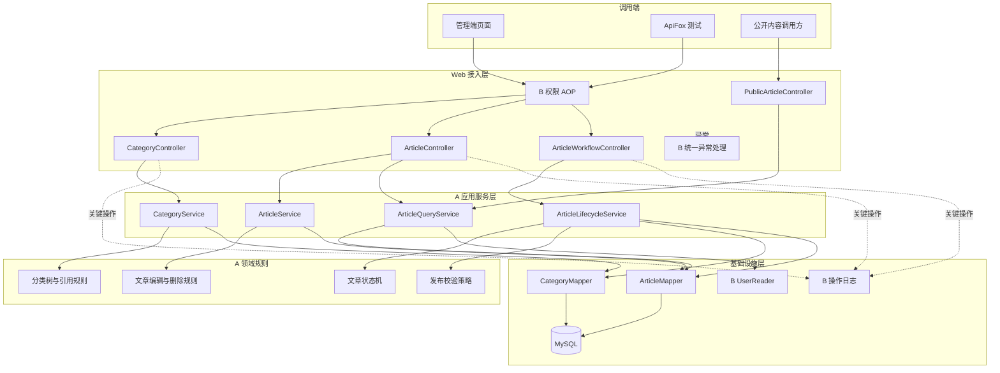
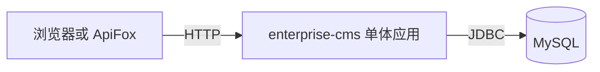

# enterprise-cms A 模块架构设计

| 项目 | 内容 |
| --- | --- |
| 文档版本 | V1.1 |
| 编制日期 | 2026-09-14 |
| 修订日期 | 2026-10-08 |
| 负责人 | A |
| 设计范围 | 内容分类、文章管理、审核发布、公开文章查询 |
| 技术基线 | Spring + Spring MVC、非 Boot MyBatis-Plus、MySQL、Maven WAR、外部 Tomcat |
| 架构形态 | 单体应用内的模块化分层架构 |
| 需求依据 | 分类、文章、审核发布模块详细需求 |
| 数据设计 | [A 模块数据库设计](A模块数据库设计.md) |

## 1 设计目标

本轮 A 重新开发，旧实现不作为基线。本设计作为重新评审输入，具体执行和验收以[A 逐项任务清单](../tasks/A模块逐项任务清单.md)为准。B 主维护无 Spring Boot 的公共工程；A 从 B 迁移验收通过的提交接入。既有设计不代表本轮功能已完成。

A 模块负责 CMS 内容领域的完整业务闭环。架构设计需要同时满足以下目标：

1. 分类、文章和状态转换具有唯一的业务实现入口。
2. Controller、Service、Mapper 职责清晰，符合课程分层要求。
3. A 能复用 B 提供的登录用户、权限、日志和统一异常能力。
4. 非法状态、重复操作和并发请求不能破坏文章数据。
5. 分页、筛选、排序、逻辑删除、自动填充和乐观锁能够体现 MyBatis-Plus 的实际使用。
6. 文章列表和分类树避免 N+1 查询。
7. 架构保持课程项目可实现，不引入微服务、消息队列和复杂工作流引擎。

## 2 范围与边界

### 2.1 A 模块负责

- 多级分类的查询、创建、编辑、移动、排序、启停和删除。
- 文章新增、编辑、详情、逻辑删除、分页和多条件查询。
- 提交审核、待审查询、审核通过、审核退回。
- 单篇发布、批量发布、下架和公开文章查询。
- 文章状态机、乐观锁、批量发布事务和内容查询优化。
- A 模块接口、测试、数据字典和设计材料。

### 2.2 B 模块负责

- 用户、角色、权限、注册、登录和退出。
- 当前用户上下文和有效权限计算。
- Spring AOP 权限注解与拦截。
- 操作日志注解、切面及日志查询。
- 统一响应、统一异常、请求标识和公共参数校验约定。

### 2.3 明确不负责

A 不直接维护用户、角色、权限和日志表，不自行实现第二套登录或权限机制。B 不通过 Mapper 或 SQL 修改分类和文章表。

课程 MVP 不实现动态内容模型、完整素材库、多站点、多语言、定时发布、复杂正文版本和多级审批。

## 3 架构决策

| 编号 | 决策 | 原因 |
| --- | --- | --- |
| ADR-A01 | 使用单体 SSM 应用，不拆微服务 | 团队只有两人，课程重点是分层、数据库和业务闭环 |
| ADR-A02 | 按业务模块组织代码，模块内部再分层 | 降低 A、B 同时修改同一目录的概率 |
| ADR-A03 | 文章记录保存当前正文和状态 | 满足课程审核流程，避免过早引入复杂版本模型 |
| ADR-A04 | 所有文章状态变化进入 `ArticleLifecycleService` | 防止 Controller 或多个 Service 各自实现状态规则 |
| ADR-A05 | 使用乐观锁版本号和条件更新 | 防止并发编辑、重复审核和旧请求覆盖新状态 |
| ADR-A06 | 批量发布采用单事务全成全败 | 语义明确，便于测试事务回滚和答辩说明 |
| ADR-A07 | 分类停用不自动下架现有文章 | 避免分类配置产生隐藏的大范围发布副作用 |
| ADR-A08 | 公开查询直接读取 `PUBLISHED` 文章 | 当前规模无需额外发布库、缓存或搜索索引 |
| ADR-A09 | B 的公共能力通过稳定接口和注解接入 | 保持模块所有权，避免直接依赖 B 的数据 Mapper |

## 4 总体架构



权限 AOP 在调用受保护 Controller 或 Service 前执行。业务通过后，A 模块继续校验分类、文章状态和版本。B 的统一异常处理将 A 抛出的业务异常映射为统一响应。

## 5 部署架构



系统以一个应用和一个数据库完成课程交付。A、B 是代码模块，不是独立进程，不通过远程 HTTP 互相调用。这样可以使用同一事务、统一登录会话和统一异常处理。

应用构建为普通 WAR，部署到外部 Tomcat，不使用 Boot main 入口或 Boot Servlet 初始化器。B 配置根容器（业务、持久层、事务）与 MVC 容器（Controller、异常处理、MVC）；限定扫描，避免重复 Bean，并在实际受保护对象所属容器启用 AOP。A 接入 content 组件和 Mapper/XML 扫描、统一分页与乐观锁插件，不自行重复建立公共配置。推荐 Spring 6.x/Tomcat 10.1；具体版本由 B 锁定并验证。

## 6 代码组织

根包名固定为 `com.zachery.cms`，公共包与模块边界以 [B 模块公共契约](B模块公共契约.md) 为准。

```text
src/main/java/com/zachery/cms/
  common/                              B 主维护
    api/
    exception/
    validation/
    context/
  security/                            B 主维护
    annotation/
    aspect/
  logging/                             B 主维护
    annotation/
    aspect/
  modules/
    content/                           A 主维护
      category/
        controller/
        service/
        mapper/
        entit…31973 tokens truncated…事务场景。

**依赖：** B-08 至 B-18。

**工作内容：**

- [ ] 注册、登录、退出、账号停用和会话失效测试。
- [ ] 角色分配、权限配置、权限撤销和越权测试。
- [ ] AOP 切点覆盖和内部调用风险测试。
- [ ] 操作日志成功、失败、敏感字段和事务回滚测试。
- [ ] 参数校验、统一异常和请求标识测试。
- [ ] 整理管理员、编辑、审核、发布和停用账号环境。
- [ ] 导出可重复执行的 ApiFox 集合。

**产物：** 自动化测试、ApiFox 导出和测试记录。

**验收：** 测试可重复运行，不依赖手工修改数据库；关键失败场景不会改变业务数据。

**建议提交：** `test(security): cover identity and authorization flows`

### B-20 完成 B 的文档和答辩材料

**目标：** 形成评分所需的个人交付证据。

**依赖：** B-19。

**工作内容：**

- [ ] 更新 B 模块架构、数据库和接口文档。
- [ ] 完成权限校验流程图和日志流程图。
- [ ] 整理 MyBatis-Plus 使用位置和 SQL 优化证据。
- [ ] 整理一个真实问题的复现、定位、修改和回归过程。
- [ ] 保留 AI 原始交互和逐项人工修改说明。
- [ ] 完成结题报告中 B 负责章节和个人实验总结。
- [ ] 在干净环境验证 SQL、配置、构建和启动说明。

**产物：** B 的报告章节、实验总结、设计图、接口和过程材料。

**验收：** 文档与实际代码一致，B 能独立解释登录、RBAC、AOP、日志事务和 N+1 优化。

**建议提交：** `docs(security): complete delivery evidence`

## 5 A 需要优先获得的 B 交付

为避免阻塞 A，B 应按以下优先级交付公共能力：

| 优先级 | 交付 | 最迟任务 | A 的用途 |
| --- | --- | --- | --- |
| 1 | `sys_user.id` 类型和建表 SQL | B-03 | 创建 A 表外键 |
| 2 | `ApiResponse`、异常和错误码 | B-06 | 编写 Controller |
| 3 | `CurrentUserContext` | B-10 | 作者、更新人、审核人 |
| 4 | `UserReader.findByIds` | B-10 | 文章列表批量组装作者 |
| 5 | `@RequirePermission` | B-14 | 分类、文章和状态接口 |
| 6 | `@OperationLog` | B-15 | 关键写操作日志 |

B-03、B-06、B-10、B-14、B-15 是跨模块阻塞任务，应优先于 B 的日志页面和最终文档。

## 6 GitHub Issue 建议

每个任务建立一个 Issue，标题格式：

```text
[B-任务号] 简短任务名称
```

例如：

```text
[B-14] 实现权限注解和 Spring AOP
```

Issue 正文至少包含：

- 目标。
- 依赖任务。
- 工作内容清单。
- 验收条件。
- 接口或数据库影响。
- 测试证据位置。

建议标签：`owner:B`、`module:security`、`type:feature`、`priority:P0`。业务里程碑使用 BM0 至 BM5，迁移任务使用 BM-SSM；Issue 可用 `[B-M01]` 等迁移编号。

## 7 每项任务完成定义

一个 B 任务只有同时满足以下条件才算完成：

- [ ] 代码或文档产物已经提交到 B 的功能分支。
- [ ] 正常和关键异常场景已经实际验证。
- [ ] 公共接口变更已经通知 A 并更新文档。
- [ ] 没有跨边界修改 A 的分类、文章和状态表。
- [ ] 没有提交密码、会话标识、真实凭证或构建产物。
- [ ] 提交内容只覆盖当前任务或有明确说明。
- [ ] B 能解释实现选择和验证依据。

## 8 B 开工顺序

本轮不重复开发远端已有业务，按以下顺序推进：

```text
B-M01～B-M04 工程与配置迁移
  -> B-M05 已实现业务回归
  -> B-M06 SSM 基线交付 / A-M00 接入
  -> B-14 权限 AOP / A 分类接口联调
  -> B-15 操作日志 / A 写操作联调
  -> B-11、B-16、B-17 剩余功能与优化
  -> B-18～B-20 联调、测试与交付
```

完成 B-14 后立即与 A 做第一次权限联调，再继续操作日志、查询优化和完整测试。
