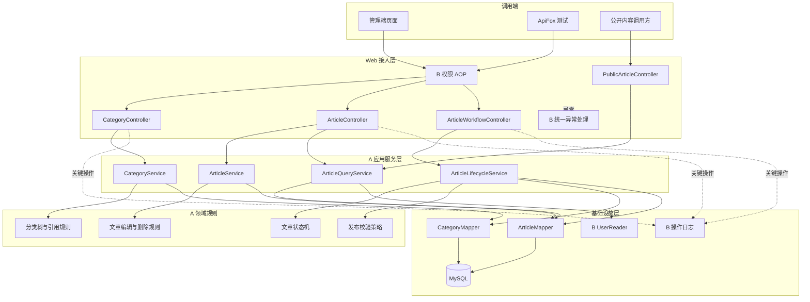
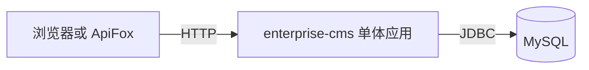
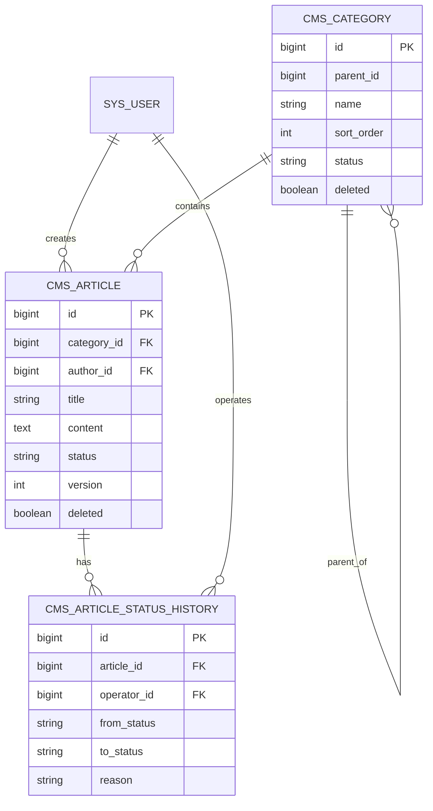
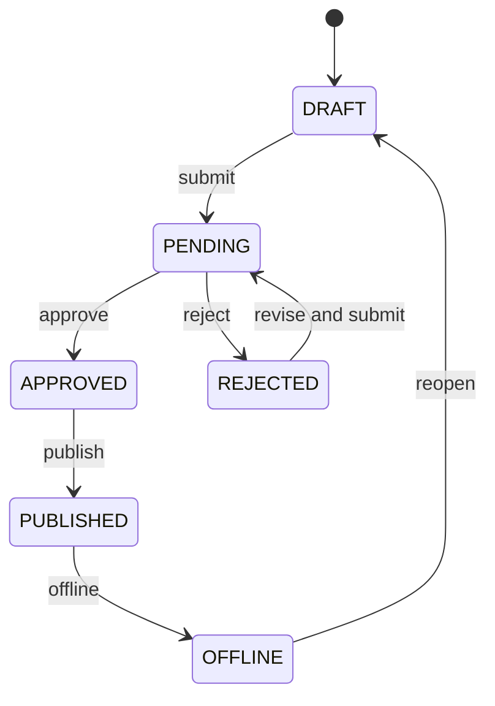
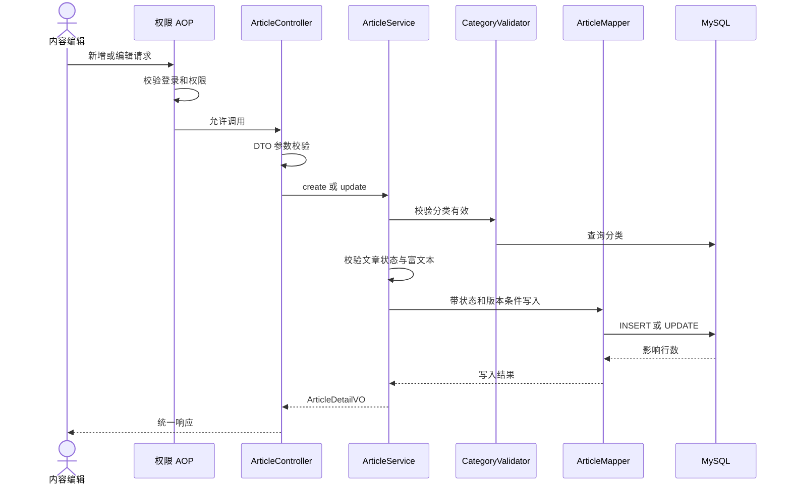
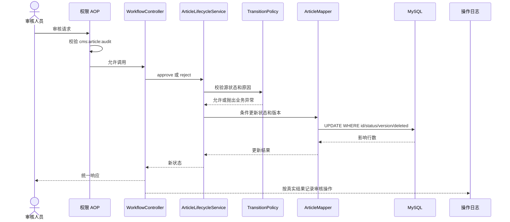
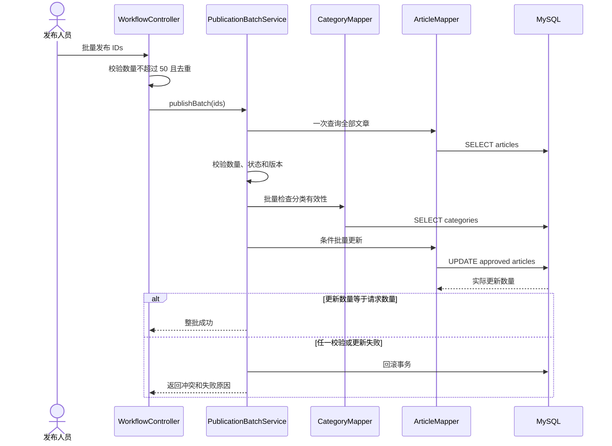

# enterprise-cms A 模块架构设计

| 项目 | 内容 |
| --- | --- |
| 文档版本 | V1.1 |
| 编制日期 | 2026-09-14 |
| 修订日期 | 2026-10-08 |
| 负责人 | A |
| 设计范围 | 内容分类、文章管理、审核发布、公开文章查询 |
| 技术基线 | Spring + Spring MVC、非 Boot MyBatis-Plus、MySQL、Maven WAR、外部 Tomcat |
| 架构形态 | 单体应用内的模块化分层架构 |
| 需求依据 | 分类、文章、审核发布模块详细需求 |
| 数据设计 | [A 模块数据库设计](A模块数据库设计.md) |

## 1 设计目标

本轮 A 重新开发，旧实现不作为基线。本设计作为重新评审输入，具体执行和验收以[A 逐项任务清单](../tasks/A模块逐项任务清单.md)为准。B 主维护无 Spring Boot 的公共工程；A 从 B 迁移验收通过的提交接入。既有设计不代表本轮功能已完成。

A 模块负责 CMS 内容领域的完整业务闭环。架构设计需要同时满足以下目标：

1. 分类、文章和状态转换具有唯一的业务实现入口。
2. Controller、Service、Mapper 职责清晰，符合课程分层要求。
3. A 能复用 B 提供的登录用户、权限、日志和统一异常能力。
4. 非法状态、重复操作和并发请求不能破坏文章数据。
5. 分页、筛选、排序、逻辑删除、自动填充和乐观锁能够体现 MyBatis-Plus 的实际使用。
6. 文章列表和分类树避免 N+1 查询。
7. 架构保持课程项目可实现，不引入微服务、消息队列和复杂工作流引擎。

## 2 范围与边界

### 2.1 A 模块负责

- 多级分类的查询、创建、编辑、移动、排序、启停和删除。
- 文章新增、编辑、详情、逻辑删除、分页和多条件查询。
- 提交审核、待审查询、审核通过、审核退回。
- 单篇发布、批量发布、下架和公开文章查询。
- 文章状态机、乐观锁、批量发布事务和内容查询优化。
- A 模块接口、测试、数据字典和设计材料。

### 2.2 B 模块负责

- 用户、角色、权限、注册、登录和退出。
- 当前用户上下文和有效权限计算。
- Spring AOP 权限注解与拦截。
- 操作日志注解、切面及日志查询。
- 统一响应、统一异常、请求标识和公共参数校验约定。

### 2.3 明确不负责

A 不直接维护用户、角色、权限和日志表，不自行实现第二套登录或权限机制。B 不通过 Mapper 或 SQL 修改分类和文章表。

课程 MVP 不实现动态内容模型、完整素材库、多站点、多语言、定时发布、复杂正文版本和多级审批。

## 3 架构决策

| 编号 | 决策 | 原因 |
| --- | --- | --- |
| ADR-A01 | 使用单体 SSM 应用，不拆微服务 | 团队只有两人，课程重点是分层、数据库和业务闭环 |
| ADR-A02 | 按业务模块组织代码，模块内部再分层 | 降低 A、B 同时修改同一目录的概率 |
| ADR-A03 | 文章记录保存当前正文和状态 | 满足课程审核流程，避免过早引入复杂版本模型 |
| ADR-A04 | 所有文章状态变化进入 `ArticleLifecycleService` | 防止 Controller 或多个 Service 各自实现状态规则 |
| ADR-A05 | 使用乐观锁版本号和条件更新 | 防止并发编辑、重复审核和旧请求覆盖新状态 |
| ADR-A06 | 批量发布采用单事务全成全败 | 语义明确，便于测试事务回滚和答辩说明 |
| ADR-A07 | 分类停用不自动下架现有文章 | 避免分类配置产生隐藏的大范围发布副作用 |
| ADR-A08 | 公开查询直接读取 `PUBLISHED` 文章 | 当前规模无需额外发布库、缓存或搜索索引 |
| ADR-A09 | B 的公共能力通过稳定接口和注解接入 | 保持模块所有权，避免直接依赖 B 的数据 Mapper |

## 4 总体架构



权限 AOP 在调用受保护 Controller 或 Service 前执行。业务通过后，A 模块继续校验分类、文章状态和版本。B 的统一异常处理将 A 抛出的业务异常映射为统一响应。

## 5 部署架构



系统以一个应用和一个数据库完成课程交付。A、B 是代码模块，不是独立进程，不通过远程 HTTP 互相调用。这样可以使用同一事务、统一登录会话和统一异常处理。

应用构建为普通 WAR，部署到外部 Tomcat，不使用 Boot main 入口或 Boot Servlet 初始化器。B 配置根容器（业务、持久层、事务）与 MVC 容器（Controller、异常处理、MVC）；限定扫描，避免重复 Bean，并在实际受保护对象所属容器启用 AOP。A 接入 content 组件和 Mapper/XML 扫描、统一分页与乐观锁插件，不自行重复建立公共配置。推荐 Spring 6.x/Tomcat 10.1；具体版本由 B 锁定并验证。

## 6 代码组织

根包名固定为 `com.zachery.cms`，公共包与模块边界以 [B 模块公共契约](B模块公共契约.md) 为准。

```text
src/main/java/com/zachery/cms/
  common/                              B 主维护
    api/
    exception/
    validation/
    context/
  security/                            B 主维护
    annotation/
    aspect/
  logging/                             B 主维护
    annotation/
    aspect/
  modules/
    content/                           A 主维护
      category/
        controller/
        service/
        mapper/
        entity/
        dto/
        vo/
      article/
        controller/
        service/
        mapper/
        entity/
        dto/
        vo/
        enums/
      publication/
        controller/
        dto/
        vo/
    identity/                          B 主维护
      auth/
      user/
      role/
      permission/

src/main/resources/
  mapper/
    content/
      CategoryMapper.xml
      ArticleMapper.xml
  spring/
  application.properties

src/test/java/com/zachery/cms/
  modules/content/
    category/
    article/
    publication/
```

如果现有 SSM 工程已采用另一种目录结构，应保持工程一致性，但下列职责不能改变。

## 7 分层职责

| 层 | 可以做什么 | 不可以做什么 |
| --- | --- | --- |
| Controller | 接收 DTO、触发校验、调用应用服务、返回 VO | 直接调用 Mapper、拼 SQL、直接修改文章状态 |
| Service | 组织业务规则、事务、对象查询和状态转换 | 返回密码等 B 模块内部数据、绕过权限入口 |
| Domain Rule 或枚举 | 表达状态转换、分类循环和业务判断 | 访问 HTTP 对象或自行开启事务 |
| Mapper | 执行持久化、条件更新和优化查询 | 决定用户是否有权限、拼接未校验排序字段 |
| Entity | 映射数据库字段 | 直接作为外部请求和响应对象 |
| DTO | 表达接口输入和校验规则 | 包含客户端不可修改的作者、状态等敏感字段 |
| VO | 表达页面或接口输出 | 暴露内部实体、逻辑删除和无关审计字段 |

## 8 A 模块组件设计

### 8.1 分类组件

| 组件 | 职责 |
| --- | --- |
| `CategoryController` | 分类树、创建、修改、移动、排序、启停和删除接口 |
| `CategoryService` | 父级校验、循环检查、引用检查和事务管理 |
| `CategoryMapper` | 分类查询、写入、后代查询和引用计数 |
| `CategoryTreeAssembler` | 将一次查询结果组装为树形 VO |
| `CategoryValidator` | 为文章保存和发布提供分类有效性校验 |

分类树查询推荐一次读取全部未删除分类，再按 `parentId` 分组组装。课程数据规模较小，无需为每个分类递归查询数据库。

### 8.2 文章组件

| 组件 | 职责 |
| --- | --- |
| `ArticleController` | 新增、编辑、详情、删除和后台分页入口 |
| `ArticleService` | 新增、编辑、删除及文章基本规则 |
| `ArticleQueryService` | 后台和公开查询、分页条件、VO 组装 |
| `ArticleMapper` | 文章持久化、分页关联查询和条件状态更新 |
| `ArticleContentSanitizer` | 按白名单清洗或验证富文本 |
| `ArticleStatus` | 定义状态和允许转换关系 |

### 8.3 审核发布组件

| 组件 | 职责 |
| --- | --- |
| `ArticleWorkflowController` | 提交、审核通过、退回、发布、批量发布和下架入口 |
| `ArticleLifecycleService` | 文章状态变化的唯一业务入口 |
| `ArticleTransitionPolicy` | 判断源状态、目标状态和业务前置条件 |
| `PublicationBatchService` | 批量校验、事务发布和结果输出 |
| `PublicArticleController` | 匿名公开文章列表和详情 |

`ArticleLifecycleService` 可以调用 `ArticleTransitionPolicy`，但最终更新必须由 `ArticleMapper` 执行带原状态和版本条件的 SQL。

## 9 领域关系



`CMS_ARTICLE_STATUS_HISTORY` 已纳入 A 模块数据库设计，用于保存文章状态变化。B 的操作日志仍独立存在，用于保存用户对系统执行的关键操作及结果。

## 10 文章状态设计



| 源状态 | 操作 | 目标状态 | 附加规则 |
| --- | --- | --- | --- |
| `DRAFT` | 提交 | `PENDING` | 标题、正文和分类有效 |
| `REJECTED` | 提交 | `PENDING` | 已完成修改，分类有效 |
| `PENDING` | 通过 | `APPROVED` | 记录审核人和时间 |
| `PENDING` | 退回 | `REJECTED` | 原因必填 |
| `APPROVED` | 发布 | `PUBLISHED` | 分类仍然启用 |
| `PUBLISHED` | 下架 | `OFFLINE` | 公开查询立即不可见 |
| `OFFLINE` | 重新编辑 | `DRAFT` | 后续重新走审核流程 |

未列出的转换全部返回 409。权限判断与状态判断必须同时存在：权限正确但状态非法仍然失败。

## 11 关键业务流程

### 11.1 新增和编辑文章



编辑影响行数为 0 时，Service 需要再次判断是文章不存在还是状态或版本冲突，并返回 404 或 409。

### 11.2 审核处理



两个审核请求同时处理时，数据库条件更新保证最多一个请求成功。

### 11.3 批量发布



批量发布 Service 使用一个事务。任何文章不合格或实际更新数量异常都必须回滚。

## 12 接口架构

### 12.1 分类接口

| 方法 | 路径 | 权限 | 应用服务 |
| --- | --- | --- | --- |
| `GET` | `/api/categories/tree` | `cms:category:read` | `CategoryService.getTree` |
| `POST` | `/api/categories` | `cms:category:manage` | `CategoryService.create` |
| `PUT` | `/api/categories/{id}` | `cms:category:manage` | `CategoryService.update` |
| `PATCH` | `/api/categories/{id}/parent` | `cms:category:manage` | `CategoryService.move` |
| `PATCH` | `/api/categories/{id}/status` | `cms:category:manage` | `CategoryService.changeStatus` |
| `PATCH` | `/api/categories/{id}/sort` | `cms:category:manage` | `CategoryService.changeSort` |
| `DELETE` | `/api/categories/{id}` | `cms:category:manage` | `CategoryService.delete` |

### 12.2 文章接口

| 方法 | 路径 | 权限 | 应用服务 |
| --- | --- | --- | --- |
| `GET` | `/api/articles` | `cms:article:read` | `ArticleQueryService.page` |
| `GET` | `/api/articles/{id}` | `cms:article:read` | `ArticleQueryService.detail` |
| `POST` | `/api/articles` | `cms:article:create` | `ArticleService.create` |
| `PUT` | `/api/articles/{id}` | `cms:article:edit` | `ArticleService.update` |
| `DELETE` | `/api/articles/{id}` | `cms:article:delete` | `ArticleService.delete` |

### 12.3 审核发布接口

| 方法 | 路径 | 权限 | 应用服务 |
| --- | --- | --- | --- |
| `POST` | `/api/articles/{id}/submission` | `cms:article:submit` | `ArticleLifecycleService.submit` |
| `GET` | `/api/articles/review-queue` | `cms:article:audit` | `ArticleQueryService.reviewPage` |
| `POST` | `/api/articles/{id}/approval` | `cms:article:audit` | `ArticleLifecycleService.approve` |
| `POST` | `/api/articles/{id}/rejection` | `cms:article:audit` | `ArticleLifecycleService.reject` |
| `POST` | `/api/articles/{id}/publication` | `cms:article:publish` | `ArticleLifecycleService.publish` |
| `POST` | `/api/article-publication-batches` | `cms:article:publish` | `PublicationBatchService.publish` |
| `POST` | `/api/articles/{id}/offline-operation` | `cms:article:offline` | `ArticleLifecycleService.offline` |
| `POST` | `/api/articles/{id}/reopen` | `cms:article:edit` | `ArticleLifecycleService.reopen` |

### 12.4 公开接口

| 方法 | 路径 | 权限 | 应用服务 |
| --- | --- | --- | --- |
| `GET` | `/api/public/articles` | 匿名 | `ArticleQueryService.publicPage` |
| `GET` | `/api/public/articles/{id}` | 匿名 | `ArticleQueryService.publicDetail` |

接口路径是架构基线。编码前应与 B 的 ApiFox 和统一命名约定进行一次最终确认。

## 13 DTO 与 VO 边界

| 类型 | 示例字段 | 禁止包含 |
| --- | --- | --- |
| `CategoryCreateRequest` | `parentId`、`name`、`sortOrder` | `id`、`deleted`、创建人 |
| `CategoryMoveRequest` | `newParentId`、`version` 或更新依据 | 任意子节点列表 |
| `ArticleCreateRequest` | `title`、`summary`、`content`、`categoryId` | `authorId`、`status`、`publishTime` |
| `ArticleUpdateRequest` | 可编辑字段、`version` | `status`、`reviewerId` |
| `ArticleReviewRequest` | `version`、`comment` | `reviewerId`、目标状态字符串 |
| `ArticleBatchPublishRequest` | 去重后的文章 ID 与版本信息 | 任意目标状态 |
| `ArticleDetailVO` | 文章、分类、作者展示和状态 | Entity、密码或内部会话信息 |
| `ArticlePageVO` | 列表必要摘要字段 | 大段正文和无关内部字段 |

客户端通过不同命令 DTO 表达意图，不能使用一个包含全部字段的通用 Article DTO 完成所有操作。

## 14 数据访问设计

### 14.1 MyBatis-Plus 使用点

- 分页插件用于文章后台列表、待审列表和公开列表。
- 条件构造器用于可选筛选条件。
- 逻辑删除用于分类和文章普通查询。
- 自动填充用于创建时间、更新时间、创建人和更新人。
- 乐观锁或显式版本条件用于文章编辑。
- 自定义 Mapper SQL 用于状态条件更新、复杂分页和批量发布。

不能为了使用 MyBatis-Plus 而放弃清晰 SQL。涉及关联展示、条件状态更新和批量事务时允许使用 XML Mapper。

### 14.2 防止 N+1

分类树：一次读取分类集合后组装，不递归查询每个节点。

文章列表：采用以下一种方案，并通过真实 SQL 次数验证：

1. 分页查询文章后，批量查询本页分类和作者并组装。
2. 使用不会破坏分页总数和行数的联表查询。

如果作者信息必须通过 B 的 Mapper 获取，应由 B 提供批量 `UserReader.findByIds`，A 不逐条读取用户。

### 14.3 排序安全

接口排序字段映射为枚举：

| 接口字段 | 数据库列 |
| --- | --- |
| `createdAt` | `created_at` |
| `updatedAt` | `updated_at` |
| `publishedAt` | `published_at` |
| `title` | `title` |

不在枚举中的排序字段返回 400。数据库列名不能从客户端字符串直接拼接。

## 15 事务设计

| 用例 | 事务边界 | 失败处理 |
| --- | --- | --- |
| 创建或编辑分类 | 单个 Service 方法 | 校验或写入失败全部回滚 |
| 移动分类 | 校验后更新父级 | 循环或并发冲突不更新 |
| 删除分类 | 引用检查与逻辑删除 | 存在子类或文章时不删除 |
| 创建或编辑文章 | 单个 Service 方法 | 分类失效或版本冲突不写入 |
| 状态转换 | 生命周期 Service 方法 | 状态条件更新失败返回 409 |
| 批量发布 | 一个批次一个事务 | 任一失败整批回滚 |

事务注解放在 Service 的公开业务方法上，避免依赖同类内部调用触发 Spring 代理。

## 16 并发与一致性

文章所有写请求使用客户端最近读取的 `version`。典型条件更新为：

```sql
UPDATE cms_article
SET status = ?, version = version + 1, updated_at = ?
WHERE id = ?
  AND status = ?
  AND version = ?
  AND deleted = 0;
```

更新后必须检查影响行数：

- 1：本次操作成功。
- 0：文章不存在、已删除、状态变化或版本过期，需要判断后返回 404 或 409。
- 大于 1：违反主键或 SQL 设计，应回滚并按服务端错误处理。

公开查询和后台查询都以数据库文章状态为权威来源，不使用前端缓存判断是否发布。

## 17 安全设计

- A 的后台接口全部使用 B 的权限注解。
- 作者、审核人和操作人只从服务端当前用户获取。
- 文章正文采用 HTML 白名单清洗或等效策略，并保留测试用例。
- 所有查询使用参数绑定。
- 排序列使用枚举映射。
- 公开接口固定包含 `PUBLISHED` 和未删除条件。
- 无权查看的对象可以返回 404，避免泄露存在性。
- 错误响应不包含 SQL、文件路径和堆栈。

## 18 日志接入

| 操作 | 日志动作建议 | 目标 |
| --- | --- | --- |
| 分类新增、编辑、移动、启停、删除 | `CATEGORY_*` | 分类 ID |
| 文章新增、编辑、删除 | `ARTICLE_*` | 文章 ID |
| 提交、通过、退回 | `ARTICLE_SUBMIT`、`ARTICLE_APPROVE`、`ARTICLE_REJECT` | 文章 ID |
| 发布、批量发布、下架 | `ARTICLE_PUBLISH`、`ARTICLE_BATCH_PUBLISH`、`ARTICLE_OFFLINE` | 文章或批次 |

日志只保存必要摘要，不保存完整文章正文。成功日志必须与业务事务真实结果一致。

## 19 异常映射

| A 模块异常 | HTTP 状态 | 示例 |
| --- | --- | --- |
| `InvalidRequestException` | 400 | 标题为空、批量数量超限 |
| `ResourceNotFoundException` | 404 | 分类或文章不存在 |
| `BusinessConflictException` | 409 | 分类循环、文章状态或版本冲突 |
| B 抛出的未登录异常 | 401 | 会话不存在或失效 |
| B 抛出的权限异常 | 403 | 当前用户缺少操作权限 |

异常类的最终名称以 B 提供的公共异常契约为准，A 不重复创建同语义异常。

## 20 测试架构


### 20.1 单元测试

- 文章状态转换矩阵。
- 分类循环判断。
- 排序字段白名单。
- 富文本安全策略。

### 20.2 集成测试

- 逻辑删除过滤。
- 乐观锁并发编辑。
- 两个审核请求竞争。
- 批量发布整批回滚。
- 分类引用删除限制。
- 公开接口状态过滤。

### 20.3 性能与 SQL 验证

- 分类树查询 SQL 次数。
- 文章分页查询 SQL 次数。
- 关联分类和作者前后返回一致性。
- 优化前后执行计划或多次测试耗时。

## 21 A 与 B 联调点

| 编号 | B 提供 | A 的接入要求 | 联调结果 |
| --- | --- | --- | --- |
| AB-01 | `CurrentUserContext` | 新增、编辑、审核时读取真实用户 | 用户 ID 无法由请求伪造 |
| AB-02 | `@RequirePermission` | 所有后台接口声明权限 | 401、403 与业务 409 可区分 |
| AB-03 | `@OperationLog` | 关键写操作接入 | 日志结果与事务一致 |
| AB-04 | 统一异常 | A 抛出公共业务异常 | 响应结构和状态码一致 |
| AB-05 | `UserReader` 批量读取 | 文章列表组装作者展示 | 不产生逐文章查询用户的 N+1 |

## 22 需求到组件追踪

| 需求 | 主要组件 | 主要验证 |
| --- | --- | --- |
| CAT-01 | `CategoryService`、`CategoryTreeAssembler`、`CategoryMapper` | 三级分类树、空树、SQL 次数 |
| CAT-02、CAT-03 | `CategoryController`、`CategoryService` | 新增编辑、同级重名、父级有效性 |
| CAT-04 | `CategoryService`、分类后代查询 | 移动到自身或后代时拒绝 |
| CAT-05、CAT-06 | `CategoryService` | 稳定排序、父级启停规则 |
| CAT-07 | `CategoryService`、`ArticleMapper` | 子类和文章引用阻止删除 |
| CAT-08 | `CategoryValidator` | 文章保存、提交和发布前校验 |
| ARTICLE-01 至 ARTICLE-03 | `ArticleController`、`ArticleService`、`ArticleQueryService` | 新增、编辑、详情及字段边界 |
| ARTICLE-04 至 ARTICLE-06 | `ArticleQueryService`、`ArticleMapper` | 分页、组合筛选、排序白名单 |
| ARTICLE-07 | `ArticleService` | 状态限制和逻辑删除过滤 |
| ARTICLE-08 | `ArticleService`、条件更新 SQL | 两个旧版本请求只能一个成功 |
| ARTICLE-09 | `ArticleContentSanitizer` | 危险标签、属性和协议测试 |
| FLOW-01 | `ArticleLifecycleService.submit` | 草稿或退回文章提交 |
| FLOW-02 | `ArticleQueryService.reviewPage` | 待审分页和筛选 |
| FLOW-03、FLOW-04 | `ArticleLifecycleService`、`TransitionPolicy` | 通过、退回、原因和审核信息 |
| FLOW-05 | `ArticleMapper` 条件更新 | 重复和并发审核冲突 |
| PUB-01 | `ArticleLifecycleService.publish` | 只有审核通过文章可发布 |
| PUB-02 | `PublicationBatchService` | 全成全败和事务回滚 |
| PUB-03 | `ArticleLifecycleService.offline` | 下架后公开查询不可见 |
| PUB-04 | `ArticleQueryService.publicPage/publicDetail` | 匿名查询仅返回发布文章 |
| PUB-05 | 状态历史 Mapper 与查询组件 | 验证状态变化的操作者、时间和原因 |

## 23 架构验收清单

- [ ] A、B 的代码和数据所有权没有交叉写入。
- [ ] Controller、Service、Mapper、DTO 和 VO 分层明确。
- [ ] 分类、文章和审核发布模块能够映射到具体组件。
- [ ] 文章状态只有 `ArticleLifecycleService` 可以改变。
- [ ] 普通编辑 DTO 不包含客户端可控状态、作者和审核人。
- [ ] 所有状态更新同时校验原状态和乐观锁版本。
- [ ] 批量发布事务满足全成全败。
- [ ] 分类树和文章列表存在明确的 N+1 规避方案。
- [ ] 所有后台接口接入权限，所有关键写操作接入日志。
- [ ] 公开接口只能读取已发布且未删除文章。
- [ ] 架构图、状态图、时序图和代码结构保持一致。
- [ ] 所有 P0 需求均能映射到组件、接口和测试。

## 24 后续设计输入

完成本架构评审后，下一阶段应据此输出 A 模块数据库设计，至少包括：

1. `cms_category` 和 `cms_article` 字段定义。
2. 主键、外键、唯一约束、检查规则和默认值。
3. 分类父子关系、分类文章关系和文章作者关系。
4. 查询、排序、状态条件更新所需索引。
5. 乐观锁、逻辑删除和审计字段。
6. 状态历史表及其与操作日志的职责边界。
7. 建表 SQL、初始化数据和 E-R 图最终版本。
