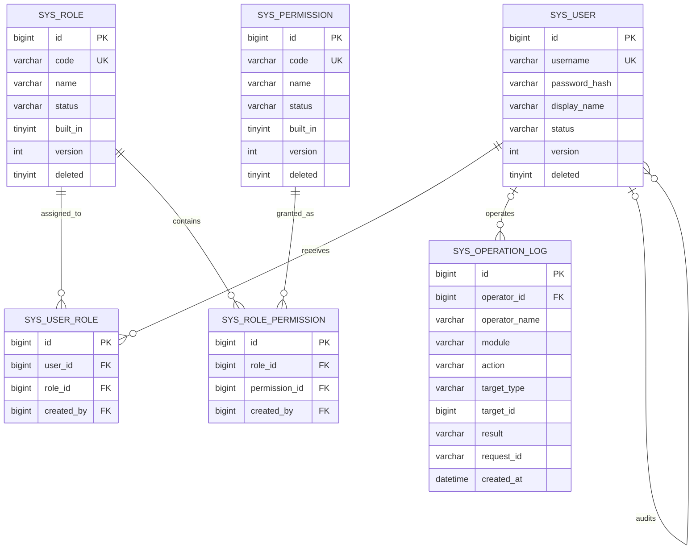

# enterprise-cms B 模块数据库设计

| 项目 | 内容 |
| --- | --- |
| 文档版本 | V1.0 |
| 编制日期 | 2026-09-17 |
| 对应任务 | B-02 |
| 负责人 | B |
| 数据库范围 | 用户、角色、权限、授权关系、操作日志 |
| 推荐数据库 | MySQL 8.0 |
| 字符集 | `utf8mb4` |
| 排序规则 | `utf8mb4_unicode_ci` |
| 后续建表脚本 | `sql/001_identity_schema.sql`（B-03） |

## 1 设计目标

本设计覆盖 B 负责的身份、权限和操作日志数据，不包含 A 负责的分类、文章和文章状态历史。设计需要满足：

1. 以用户、角色、权限和两张关联表实现标准 RBAC，不用逗号分隔文本保存多对多关系。
2. 使用数据库唯一约束兜底用户名、角色编码、权限编码和重复授权冲突。
3. 支持服务端 Session 登录、用户分页、账号启停和下一请求重新计算权限。
4. 保留文章、审核和日志对用户的历史引用，不物理删除已进入业务流程的用户。
5. 操作日志支持按操作者、模块、动作、结果和时间范围稳定分页查询。
6. 与 A 固定 `sys_user.id BIGINT UNSIGNED` 外键契约，并保证 B 的建表脚本先于 A 执行。

## 2 表范围与迁移顺序

### 2.1 B 负责的六张表

| 表 | 用途 | 数据生命周期 |
| --- | --- | --- |
| `sys_user` | 登录账号、密码摘要和账号状态 | 状态管理并逻辑删除 |
| `sys_role` | 稳定角色编码和展示信息 | 状态管理并逻辑删除 |
| `sys_permission` | 可用于 AOP 校验的稳定权限编码 | 状态管理并逻辑删除 |
| `sys_user_role` | 用户与角色多对多关系 | 授权时插入，撤销时物理删除 |
| `sys_role_permission` | 角色与权限多对多关系 | 授权时插入，撤销时物理删除 |
| `sys_operation_log` | 关键操作及结果的只读审计记录 | 只追加，不提供业务删除 |

### 2.2 建表和初始化顺序

1. `sys_user`。
2. `sys_role`、`sys_permission`。
3. `sys_user_role`、`sys_role_permission`。
4. `sys_operation_log`。
5. A 的 `cms_category`、`cms_article`、`cms_article_status_history`。
6. B 的角色、权限和演示账号初始化数据。

`sql/001_identity_schema.sql` 必须先于 `sql/002_content_schema.sql` 执行。初始化数据单独放入 `sql/003_identity_seed.sql`，避免建表与演示账号数据耦合。

## 3 公共数据库规则

| 项目 | 规则 |
| --- | --- |
| 存储引擎 | 全部使用 InnoDB |
| 主键 | `id BIGINT UNSIGNED AUTO_INCREMENT` |
| 时间 | `DATETIME(3)`，统一保存 UTC |
| 文本 | `utf8mb4`、`utf8mb4_unicode_ci` |
| 状态 | 使用大写英文稳定编码 |
| 逻辑删除 | `deleted TINYINT UNSIGNED`，0 有效、1 删除 |
| 乐观锁 | 可编辑主数据使用 `version INT UNSIGNED` |
| 审计字段 | 主数据使用 `created_by`、`created_at`、`updated_by`、`updated_at` |
| 外键动作 | 默认 `ON UPDATE RESTRICT ON DELETE RESTRICT`，不级联删除业务和审计数据 |
| 排序 | 分页索引最后追加 `id`，相同时间下仍保持稳定顺序 |

用户名、角色编码和权限编码使用当前不区分大小写的排序规则进行唯一比较。应用层仍必须先去除首尾空白并将角色、权限编码规范化为大写。数据库 `CHECK` 约束只负责阻止明显坏值，完整格式校验由 Jakarta Validation 和 Service 完成。

## 4 概念 E-R 图



`sys_operation_log.target_id` 是多业务对象的数值标识，因此不建立多态外键；`operator_id` 只关联真实用户。登录失败等匿名操作允许 `operator_id` 为空。

## 5 `sys_user` 用户表

### 5.1 表职责

保存可登录账号、密码摘要、展示名称和可用状态。角色及权限不放在本表文本字段中，而是通过两级关联关系计算。

### 5.2 字段字典

| 字段 | 类型 | 空值 | 默认值 | 说明 |
| --- | --- | --- | --- | --- |
| `id` | `BIGINT UNSIGNED` | 否 | 自增 | 用户主键，也是 A 模块用户外键目标 |
| `username` | `VARCHAR(64)` | 否 | 无 | 登录名；去除首尾空白后长度 3～64 |
| `password_hash` | `VARCHAR(255)` | 否 | 无 | PBKDF2 摘要字符串，禁止保存明文 |
| `display_name` | `VARCHAR(100)` | 否 | 无 | 页面展示名称 |
| `status` | `VARCHAR(16)` | 否 | `ACTIVE` | `ACTIVE` 或 `DISABLED` |
| `password_changed_at` | `DATETIME(3)` | 否 | 当前时间 | 最近一次设置密码时间 |
| `version` | `INT UNSIGNED` | 否 | `0` | 账号启停和资料更新的乐观锁 |
| `deleted` | `TINYINT UNSIGNED` | 否 | `0` | 0 有效，1 逻辑删除 |
| `created_by` | `BIGINT UNSIGNED` | 是 | `NULL` | 创建者；匿名注册或首个种子账号允许为空 |
| `created_at` | `DATETIME(3)` | 否 | 当前时间 | 创建时间 |
| `updated_by` | `BIGINT UNSIGNED` | 是 | `NULL` | 最近更新者 |
| `updated_at` | `DATETIME(3)` | 否 | 当前时间并自动维护 | 最近更新时间 |

### 5.3 约束与规则

- 主键：`pk_sys_user (id)`。
- 唯一约束：`uq_sys_user_username (username)`，逻辑删除后也不得复用用户名，以避免历史作者和日志显示歧义。
- 自引用外键：`created_by`、`updated_by -> sys_user.id`；首个初始化用户允许为空。
- 检查：`CHAR_LENGTH(TRIM(username)) BETWEEN 3 AND 64`。
- 检查：`CHAR_LENGTH(TRIM(display_name)) BETWEEN 1 AND 100`。
- 检查：`status IN ('ACTIVE', 'DISABLED')`。
- 检查：`deleted IN (0, 1)`。
- 业务读取的有效用户条件固定为 `deleted = 0 AND status = 'ACTIVE'`。
- 账号停用、删除和密码变更不得物理删除用户或修改用户主键。

### 5.4 索引

| 索引 | 字段 | 依据 |
| --- | --- | --- |
| `uq_sys_user_username` | `username` | 登录精确查询、注册并发唯一兜底 |
| `idx_user_admin_page` | `deleted, created_at, id` | 默认用户分页和创建时间范围 |
| `idx_user_status_page` | `status, deleted, created_at, id` | 账号状态筛选和稳定分页 |

用户名包含式模糊搜索 `%keyword%` 无法有效使用普通 B-Tree。课程数据量下接受在已分页管理查询中使用；前缀搜索 `keyword%` 可以利用唯一索引。不得为了展示模糊搜索而建立无效的普通索引。

## 6 `sys_role` 角色表

### 6.1 字段字典

| 字段 | 类型 | 空值 | 默认值 | 说明 |
| --- | --- | --- | --- | --- |
| `id` | `BIGINT UNSIGNED` | 否 | 自增 | 角色主键 |
| `code` | `VARCHAR(64)` | 否 | 无 | 稳定角色编码，如 `ADMIN` |
| `name` | `VARCHAR(100)` | 否 | 无 | 角色展示名称 |
| `description` | `VARCHAR(500)` | 是 | `NULL` | 非敏感说明 |
| `status` | `VARCHAR(16)` | 否 | `ENABLED` | `ENABLED` 或 `DISABLED` |
| `built_in` | `TINYINT UNSIGNED` | 否 | `0` | 1 表示系统预置角色 |
| `version` | `INT UNSIGNED` | 否 | `0` | 角色编辑的乐观锁 |
| `deleted` | `TINYINT UNSIGNED` | 否 | `0` | 逻辑删除标识 |
| `created_by` | `BIGINT UNSIGNED` | 是 | `NULL` | 创建者，种子数据允许为空 |
| `created_at` | `DATETIME(3)` | 否 | 当前时间 | 创建时间 |
| `updated_by` | `BIGINT UNSIGNED` | 是 | `NULL` | 最近更新者 |
| `updated_at` | `DATETIME(3)` | 否 | 当前时间并自动维护 | 最近更新时间 |

### 6.2 约束与索引

- 主键：`pk_sys_role (id)`。
- 唯一约束：`uq_sys_role_code (code)`；逻辑删除后也不复用稳定编码。
- 外键：`created_by`、`updated_by -> sys_user.id`。
- 检查：编码和名称去除首尾空白后非空；`status IN ('ENABLED', 'DISABLED')`；`built_in`、`deleted IN (0, 1)`。
- 索引：`idx_role_status (status, deleted, id)`，用于读取有效角色和管理列表。
- `built_in = 1` 的角色不能通过普通接口删除或修改编码；停用前必须确认不会使唯一管理员失去管理能力。

## 7 `sys_permission` 权限表

### 7.1 字段字典

| 字段 | 类型 | 空值 | 默认值 | 说明 |
| --- | --- | --- | --- | --- |
| `id` | `BIGINT UNSIGNED` | 否 | 自增 | 权限主键 |
| `code` | `VARCHAR(100)` | 否 | 无 | AOP 使用的稳定权限编码，如 `cms:article:edit` |
| `name` | `VARCHAR(100)` | 否 | 无 | 权限展示名称 |
| `description` | `VARCHAR(500)` | 是 | `NULL` | 权限用途说明 |
| `status` | `VARCHAR(16)` | 否 | `ENABLED` | `ENABLED` 或 `DISABLED` |
| `built_in` | `TINYINT UNSIGNED` | 否 | `1` | 是否为代码和种子数据约定的权限 |
| `version` | `INT UNSIGNED` | 否 | `0` | 权限配置的乐观锁 |
| `deleted` | `TINYINT UNSIGNED` | 否 | `0` | 逻辑删除标识 |
| `created_by` | `BIGINT UNSIGNED` | 是 | `NULL` | 创建者，种子数据允许为空 |
| `created_at` | `DATETIME(3)` | 否 | 当前时间 | 创建时间 |
| `updated_by` | `BIGINT UNSIGNED` | 是 | `NULL` | 最近更新者 |
| `updated_at` | `DATETIME(3)` | 否 | 当前时间并自动维护 | 最近更新时间 |

### 7.2 约束与索引

- 主键：`pk_sys_permission (id)`。
- 唯一约束：`uq_sys_permission_code (code)`；删除后不得复用不同语义。
- 外键：`created_by`、`updated_by -> sys_user.id`。
- 检查：编码和名称非空；`status IN ('ENABLED', 'DISABLED')`；`built_in`、`deleted IN (0, 1)`。
- 索引：`idx_permission_status (status, deleted, id)`，用于有效权限集合和管理列表。
- B-01 固定的 15 个权限均使用 `built_in = 1`。普通管理接口只能调整角色与权限关系，不删除内置权限编码。

## 8 `sys_user_role` 用户角色关联表

### 8.1 字段字典

| 字段 | 类型 | 空值 | 默认值 | 说明 |
| --- | --- | --- | --- | --- |
| `id` | `BIGINT UNSIGNED` | 否 | 自增 | 关联记录主键 |
| `user_id` | `BIGINT UNSIGNED` | 否 | 无 | 用户 ID |
| `role_id` | `BIGINT UNSIGNED` | 否 | 无 | 角色 ID |
| `created_by` | `BIGINT UNSIGNED` | 否 | 无 | 分配者；自助注册默认角色时记录新用户自身 |
| `created_at` | `DATETIME(3)` | 否 | 当前时间 | 分配时间 |

### 8.2 约束与索引

- 主键：`pk_sys_user_role (id)`。
- 组合唯一约束：`uq_user_role_pair (user_id, role_id)`，并发重复分配时只允许一条成功。
- 外键：`user_id -> sys_user.id`、`role_id -> sys_role.id`、`created_by -> sys_user.id`，全部限制物理删除。
- 反向索引：`idx_user_role_role (role_id, user_id)`，支持查询角色下用户以及删除/停用角色前的引用检查。
- 用户有效角色查询利用组合唯一索引的左前缀 `user_id`。

关联表不设置 `status` 或 `deleted`。集合覆盖式授权在一个事务中删除旧关系、插入目标关系，并由操作日志记录变更摘要；这样不会让“已撤销但逻辑未删”的旧行占用组合唯一约束。

## 9 `sys_role_permission` 角色权限关联表

### 9.1 字段字典

| 字段 | 类型 | 空值 | 默认值 | 说明 |
| --- | --- | --- | --- | --- |
| `id` | `BIGINT UNSIGNED` | 否 | 自增 | 关联记录主键 |
| `role_id` | `BIGINT UNSIGNED` | 否 | 无 | 角色 ID |
| `permission_id` | `BIGINT UNSIGNED` | 否 | 无 | 权限 ID |
| `created_by` | `BIGINT UNSIGNED` | 否 | 无 | 配置者 |
| `created_at` | `DATETIME(3)` | 否 | 当前时间 | 授权时间 |

### 9.2 约束与索引

- 主键：`pk_sys_role_permission (id)`。
- 组合唯一约束：`uq_role_permission_pair (role_id, permission_id)`，阻止重复权限关系。
- 外键：`role_id -> sys_role.id`、`permission_id -> sys_permission.id`、`created_by -> sys_user.id`。
- 反向索引：`idx_role_permission_permission (permission_id, role_id)`，支持权限引用检查和按权限查角色。
- 角色有效权限查询利用组合唯一索引的左前缀 `role_id`。

本表同样使用事务内物理增删表达当前授权集合。用户的最终有效权限只包含未删除、状态有效的用户、角色和权限；不能只连接关联表后忽略主数据状态。

## 10 `sys_operation_log` 操作日志表

### 10.1 表职责

保存关键写操作和必要登录事件的实际结果。日志回答“谁在何时对什么执行了什么，结果如何”，不代替 A 的文章状态历史。

### 10.2 字段字典

| 字段 | 类型 | 空值 | 默认值 | 说明 |
| --- | --- | --- | --- | --- |
| `id` | `BIGINT UNSIGNED` | 否 | 自增 | 日志主键 |
| `operator_id` | `BIGINT UNSIGNED` | 是 | `NULL` | 操作者；匿名登录失败等场景为空 |
| `operator_name` | `VARCHAR(100)` | 是 | `NULL` | 操作者展示名快照，不作为身份依据 |
| `module` | `VARCHAR(64)` | 否 | 无 | 稳定模块编码，如 `ARTICLE`、`USER` |
| `action` | `VARCHAR(64)` | 否 | 无 | 稳定动作编码，如 `CREATE`、`DISABLE` |
| `target_type` | `VARCHAR(64)` | 是 | `NULL` | 目标类型，如 `ARTICLE`、`USER` |
| `target_id` | `BIGINT UNSIGNED` | 是 | `NULL` | 目标数值 ID；无法取得时为空 |
| `result` | `VARCHAR(16)` | 否 | 无 | `SUCCESS` 或 `FAILURE` |
| `summary` | `VARCHAR(500)` | 是 | `NULL` | 脱敏后的必要摘要 |
| `error_code` | `VARCHAR(64)` | 是 | `NULL` | 失败时的稳定业务码，不保存堆栈 |
| `request_id` | `VARCHAR(64)` | 否 | 无 | 对应 `X-Request-Id` |
| `ip_address` | `VARCHAR(45)` | 是 | `NULL` | 规范化后的 IPv4/IPv6，可选 |
| `created_at` | `DATETIME(3)` | 否 | 当前时间 | 事件发生时间 |

### 10.3 约束与日志安全

- 主键：`pk_sys_operation_log (id)`。
- 外键：`operator_id -> sys_user.id ON DELETE RESTRICT`；匿名事件允许为空。
- 检查：`module`、`action`、`request_id` 去除空白后非空。
- 检查：`result IN ('SUCCESS', 'FAILURE')`。
- 检查：`result = 'FAILURE'` 时允许记录 `error_code`，但任何结果都不得保存异常堆栈。
- 不保存密码、密码摘要、Session ID、Cookie、CSRF 令牌、完整请求体或文章正文。
- 日志只追加，不设置 `updated_at`、`updated_by`、`version` 或 `deleted`，业务接口不提供修改和删除。
- 成功日志与业务写操作加入同一事务；失败日志需要保留时使用明确的独立事务并标记 `FAILURE`。

### 10.4 索引

| 索引 | 字段 | 依据 |
| --- | --- | --- |
| `idx_log_time` | `created_at, id` | 默认倒序分页、时间范围筛选和稳定排序 |
| `idx_log_operator_time` | `operator_id, created_at, id` | 按操作者和时间查询 |
| `idx_log_module_action_time` | `module, action, created_at, id` | 模块/动作组合查询 |
| `idx_log_result_time` | `result, created_at, id` | 成功或失败结果筛选 |
| `idx_log_request` | `request_id, id` | 根据请求标识关联服务端日志 |
| `idx_log_target` | `target_type, target_id, created_at, id` | 查看某业务对象的操作轨迹 |

如果查询仅给出 `action` 而不提供 `module`，`idx_log_module_action_time` 不能完全利用左前缀。课程 MVP 的日志页面应优先将模块与动作联动；数据量增长后再根据慢查询证据决定是否增加独立动作索引。

## 11 状态、删除和历史引用策略

### 11.1 有效授权计算

用户具备权限必须同时满足：

```text
sys_user.deleted = 0
AND sys_user.status = 'ACTIVE'
AND sys_role.deleted = 0
AND sys_role.status = 'ENABLED'
AND sys_permission.deleted = 0
AND sys_permission.status = 'ENABLED'
```

授权查询通过 `sys_user_role` 和 `sys_role_permission` 连接，使用 `DISTINCT permission.code` 去除用户多个角色产生的重复权限。角色或权限状态变更后，下一次受保护请求重新计算并生效。

### 11.2 账号停用与逻辑删除

- 停用账号只更新 `status = 'DISABLED'` 并增加 `version`，不删除角色关系和历史数据。
- 逻辑删除只用于明确退出系统范围的主数据；删除用户同时应置为停用，但仍保留主键行。
- 已被 A 的文章、审核历史或 B 的操作日志引用的用户永不物理删除。
- 用户名、角色编码和权限编码的唯一约束不包含 `deleted`，历史编码不能被另一对象接管。
- 角色和权限存在关联关系时拒绝删除；先撤销当前关联，再做逻辑删除。

### 11.3 关联关系历史

两张关联表只表达“当前授权”，撤销采用物理删除。授权变更历史由 `sys_operation_log` 保存操作者、目标和脱敏摘要。摘要可以记录变更前后 ID 集合或数量，但必须限制长度且不得复制敏感数据。

## 12 与 A 模块的外键契约

| A 表字段 | 引用 | 删除规则 |
| --- | --- | --- |
| `cms_category.created_by`、`updated_by` | `sys_user.id` | `RESTRICT` |
| `cms_article.author_id`、`reviewer_id`、`created_by`、`updated_by` | `sys_user.id` | `RESTRICT` |
| `cms_article_status_history.operator_id` | `sys_user.id` | `RESTRICT` |

`sys_user.id` 固定为 `BIGINT UNSIGNED`，不得改成字符串、UUID 文本或有符号整数。A 只能通过 `CurrentUserContext` 和 `UserReader` 使用身份信息，不直接查询 B 的 Mapper，也不修改用户状态。

## 13 B-03 实现约束

后续 SQL 必须忠实实现本设计，并至少验证：

1. 在 MySQL 8.0 空库中可先执行 `001`，再执行 A 的 `002`。
2. 重复用户名、角色编码、权限编码分别触发唯一约束。
3. 重复用户角色和角色权限分别触发组合唯一约束。
4. 被 A 或日志引用的用户无法物理删除。
5. 非法状态、逻辑删除值和日志结果被 `CHECK` 约束拒绝。
6. 预置密码只保存符合 B-01 格式的摘要。
7. `EXPLAIN` 能对用户分页、权限计算和日志主要筛选使用预期索引。

## 14 B-02 验收结果

- [x] 已定义六张 B 模块表的字段字典。
- [x] 已定义主键、外键、唯一约束、非空约束、检查约束和删除规则。
- [x] 用户名、角色编码和权限编码具有不可复用的唯一约束设计。
- [x] 两张关联表分别具有组合唯一约束，不使用文本字段保存多对多关系。
- [x] 已明确账号状态、逻辑删除、授权撤销和历史引用策略。
- [x] 已提供 E-R 图、迁移顺序、查询索引及其建立依据。
- [x] `sys_user.id` 与 A 的 `BIGINT UNSIGNED` 外键契约一致。

B-02 已完成。下一步 B-03 根据本文生成 `sql/001_identity_schema.sql` 和 `sql/003_identity_seed.sql`，不得在实现阶段静默改变字段类型、唯一约束或删除语义。
