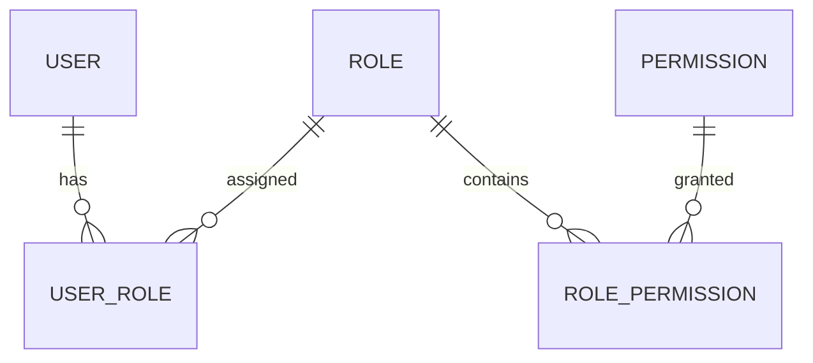

# 角色与权限管理模块需求分析

| 项目 | 内容 |
| --- | --- |
| 模块负责人 | B |
| 主要参与者 | 管理员、所有受保护接口调用者 |
| 上游依赖 | 用户认证与当前用户上下文 |
| 下游使用方 | 分类、文章、审核发布、日志管理 |

## 1 模块目标

本模块使用用户、角色和权限三类对象建立细粒度授权。用户通过角色获得权限，服务端通过 Spring AOP 校验接口所需权限。

本模块只负责“是否允许执行操作”，不负责文章状态、分类引用等领域规则。通过权限校验后，业务模块仍需继续执行自己的状态和数据校验。

## 2 权限模型

### 2.1 对象规则

| 对象 | 关键规则 |
| --- | --- |
| 用户 | 可以拥有零个或多个角色；正常业务账号至少应有一个有效角色 |
| 角色 | 使用唯一角色编码；角色名称用于展示，角色编码用于稳定识别 |
| 权限 | 使用唯一权限编码；权限表示一个可验证的接口操作能力 |
| 用户角色关系 | 同一用户与角色组合唯一 |
| 角色权限关系 | 同一角色与权限组合唯一 |

## 3 功能需求

| 编号 | 优先级 | 需求 | 业务结果 |
| --- | --- | --- | --- |
| RBAC-01 | P0 | 角色查询 | 管理员查看角色及状态 |
| RBAC-02 | P0 | 权限查询 | 管理员查看系统支持的权限编码 |
| RBAC-03 | P0 | 用户角色分配 | 用一个明确请求设置用户角色集合 |
| RBAC-04 | P0 | 角色权限配置 | 用一个明确请求设置角色权限集合 |
| RBAC-05 | P0 | 有效权限计算 | 根据有效用户、角色和关系计算权限合集 |
| RBAC-06 | P0 | 方法级权限注解 | 受保护方法声明所需权限 |
| RBAC-07 | P0 | Spring AOP 权限拦截 | 调用业务方法前校验登录和权限 |
| RBAC-08 | P0 | 权限变更生效 | 变更后按统一规则影响后续请求 |

## 4 角色与权限配置规则

1. 只有具备对应管理权限的用户才能分配角色或配置权限。
2. 请求中的用户、角色和权限必须存在且处于可用状态。
3. 关联关系由服务端去重，数据库组合唯一约束负责并发兜底。
4. 设置角色集合和设置权限集合采用“目标集合覆盖当前集合”语义，避免调用方不清楚增量状态。
5. 空角色集合是否允许必须明确。课程 MVP 建议允许管理员清空普通用户角色，但不能清空唯一管理员自身的管理能力。
6. 系统预置权限编码不能通过普通接口随意删除；新增权限主要通过初始化数据或受控配置完成。
7. 删除或停用角色前，应确认其用户关系处理方式。课程 MVP 建议有用户引用时拒绝删除。

## 5 权限校验规则

1. 匿名接口采用明确白名单，包括注册、登录和公开文章查询。
2. 其他接口默认要求登录；需要具体业务权限的接口使用权限注解。
3. 未登录访问返回 401，已登录但权限不足返回 403。
4. AOP 校验必须覆盖 A 的分类、文章、审核、发布和下架接口。
5. 权限注解只能引用已登记的权限编码；拼写错误应在测试或启动检查中暴露。
6. 同一方法需要多个权限时必须明确“全部满足”或“满足任一”。课程 MVP 优先每个方法声明一个核心权限。
7. 通过 AOP 只代表授权通过，不代表文章状态、对象归属或参数合法。
8. 需要检查 Spring 代理范围和同类内部调用，不能因内部调用绕过关键权限入口。

## 6 权限编码基线

| 业务域 | 权限编码 |
| --- | --- |
| 用户 | `cms:user:read`、`cms:user:manage` |
| 角色权限 | `cms:role:assign`、`cms:permission:manage` |
| 分类 | `cms:category:read`、`cms:category:manage` |
| 文章 | `cms:article:read`、`cms:article:create`、`cms:article:edit`、`cms:article:delete` |
| 审核发布 | `cms:article:submit`、`cms:article:audit`、`cms:article:publish`、`cms:article:offline` |
| 日志 | `cms:log:read` |

新增或重命名权限编码属于跨模块变更，必须同步初始化 SQL、注解、页面按钮、ApiFox 用例和需求文档。

## 7 数据可见性

课程 MVP 主要验证操作权限，不实现复杂的部门、站点或字段级数据范围。列表和详情仍应遵循以下规则：

- 匿名用户只能读取公开发布文章。
- 后台文章查询需要 `cms:article:read`。
- 用户、角色、权限和日志查询只对相应管理权限开放。
- 对无权查看的具体对象，允许返回 404，避免泄露对象是否存在。

## 8 异常与边界场景

| 场景 | 预期结果 |
| --- | --- |
| 未登录直接调用文章新增接口 | 401 |
| 编辑账号调用审核接口 | 403，文章状态不变 |
| 审核账号调用发布接口 | 403，文章状态不变 |
| 普通用户分配管理员角色 | 403，关系表不变 |
| 分配不存在的角色 ID | 400 或 404，不写入部分关系 |
| 重复角色或权限 ID | 服务端去重或 400，数据库不产生重复关系 |
| 权限撤销后再次调用 | 按约定在下一请求生效 |
| 权限通过但文章状态非法 | 由文章模块返回 409 |

## 9 验收标准

- 用户、角色、权限及两张关联表关系正确。
- 管理员可以配置角色，普通用户不能越权配置。
- AOP 对 A、B 两类模块均真实生效。
- 401、403 和业务 409 可以清楚区分。
- 权限撤销后不需要修改数据库会话数据即可按约定生效。
- ApiFox 至少使用管理员、编辑、审核和发布四类账号验证允许与拒绝。
- 能说明 AOP 切点、当前用户来源、权限计算和内部调用风险。

## 10 不在本阶段范围

- 部门、站点、栏目和字段级数据权限。
- 显式拒绝规则、权限继承和临时授权。
- OAuth、OIDC、JWT 网关和外部身份平台。
- 权限缓存的分布式一致性。
