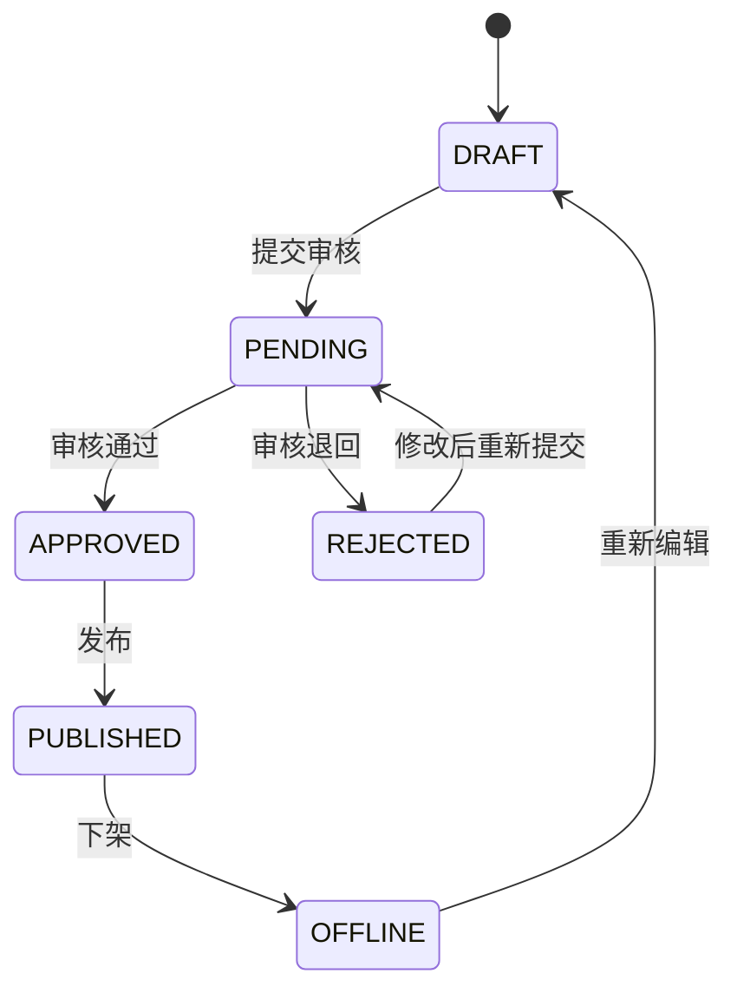

# 审核与发布管理模块需求分析

| 项目 | 内容 |
| --- | --- |
| 模块负责人 | A |
| 页面协作 | B 可以开发审核和发布操作页面，但调用 A 的接口 |
| 主要参与者 | 内容编辑、审核人员、发布人员 |
| 上游依赖 | 文章、分类、用户认证、角色权限 |
| 下游使用方 | 公开文章查询、操作日志、答辩主流程 |

## 1 模块目标

本模块控制文章从草稿到审核、发布和下架的状态变化，保证未经批准的文章不能公开，非法或并发操作不能产生错误最终状态。

文章状态只能由 A 负责的生命周期服务修改。B 提供当前用户、权限 AOP 和日志能力，不直接更新文章状态。

## 2 状态机

| 当前状态 | 操作 | 目标状态 | 权限 |
| --- | --- | --- | --- |
| `DRAFT` | 提交审核 | `PENDING` | `cms:article:submit` |
| `REJECTED` | 提交审核 | `PENDING` | `cms:article:submit` |
| `PENDING` | 审核通过 | `APPROVED` | `cms:article:audit` |
| `PENDING` | 审核退回 | `REJECTED` | `cms:article:audit` |
| `APPROVED` | 发布 | `PUBLISHED` | `cms:article:publish` |
| `PUBLISHED` | 下架 | `OFFLINE` | `cms:article:offline` |
| `OFFLINE` | 进入重新编辑 | `DRAFT` | `cms:article:edit` |

未列出的状态转换全部非法。

## 3 功能需求

| 编号 | 优先级 | 需求 | 业务结果 |
| --- | --- | --- | --- |
| FLOW-01 | P0 | 提交审核 | 草稿或退回文章进入审核中 |
| FLOW-02 | P0 | 待审列表 | 审核人员分页查看审核中文章 |
| FLOW-03 | P0 | 审核通过 | 审核中文章进入审核通过 |
| FLOW-04 | P0 | 审核退回 | 保存原因并进入退回状态 |
| FLOW-05 | P0 | 并发状态控制 | 重复或过期请求不会覆盖新状态 |
| PUB-01 | P0 | 单篇发布 | 审核通过文章成为公开文章 |
| PUB-02 | P0 | 批量发布 | 以整批事务发布多篇合格文章 |
| PUB-03 | P0 | 下架 | 已发布文章停止公开访问 |
| PUB-04 | P0 | 公开文章查询 | 匿名用户只能读取已发布文章 |
| PUB-05 | P0 | 状态历史 | 查询文章状态变化的操作者、时间和原因 |

## 4 提交审核规则

1. 提交需要 `cms:article:submit` 权限。
2. 只有 `DRAFT` 和 `REJECTED` 可以提交。
3. 提交前重新校验标题、正文、分类和逻辑删除状态。
4. 分类必须存在、未删除且启用。
5. 请求携带文章乐观锁版本号。
6. 提交成功后文章进入 `PENDING`，普通编辑接口不再允许修改。
7. 重复提交或版本过期返回 409。

## 5 待审列表规则

1. 待审列表需要 `cms:article:audit` 权限。
2. 只返回 `PENDING` 且未删除的文章。
3. 支持标题、分类、作者和提交时间筛选。
4. 使用数据库分页和稳定排序。
5. 课程 MVP 不实现复杂任务分派，所有具备审核权限的人员可查看待审列表。

## 6 审核规则

1. 审核通过和退回都需要 `cms:article:audit` 权限。
2. 只有 `PENDING` 状态可以审核。
3. 退回原因必填；通过意见可以选填。
4. 审核人和审核时间从服务端记录。
5. 审核请求必须携带文章乐观锁版本号。
6. 第一个成功审核请求改变文章状态，后续重复或并发请求返回 409。
7. 课程 MVP 是否禁止作者审核自己属于待确认项；若未实现，应在报告中明确。

## 7 发布规则

1. 发布需要 `cms:article:publish` 权限。
2. 只有 `APPROVED` 状态可以发布。
3. 发布前再次校验文章、分类和逻辑删除状态。
4. 发布成功后设置 `PUBLISHED` 和发布时间。
5. 公开接口只根据业务数据库中的 `PUBLISHED` 状态返回文章。
6. 重复发布和过期版本请求返回 409，不伪装成新的成功操作。

## 8 批量发布规则

1. 单批最多 50 条，文章 ID 需要去重。
2. 在写入前一次性检查所有文章是否存在、未删除且处于 `APPROVED`。
3. 当前用户必须具备发布权限。
4. 整批采用同一事务；任意一条失败，全部文章状态保持不变。
5. 失败响应说明首个或全部可识别的失败文章及原因。
6. 批量更新必须同时校验原状态，不能只按 ID 修改。
7. 不在循环中逐条提交事务。

## 9 下架和重新编辑规则

1. 下架需要 `cms:article:offline` 权限。
2. 只有 `PUBLISHED` 状态可以下架。
3. 下架成功后状态变为 `OFFLINE`，公开接口立即不再返回。
4. 重复下架返回 409。
5. `OFFLINE` 文章重新编辑前先进入 `DRAFT`；后续仍需重新审核和发布。
6. 下架不等于删除，后台仍可查询文章和历史操作。

## 10 公开查询规则

1. 公开列表和详情允许匿名访问。
2. 查询条件必须包含 `status = PUBLISHED` 和未逻辑删除条件。
3. 草稿、审核中、退回、审核通过和下架文章均不能通过公开接口读取。
4. 请求不存在或非公开文章时统一返回 404，不能泄露后台状态。
5. 公开列表使用数据库分页并限制页大小。

## 11 事务与并发规则

1. 单篇状态变化至少在一个业务事务内完成文章更新和必要业务记录。
2. 状态 SQL 同时匹配文章 ID、原状态、乐观锁版本和逻辑删除标识。
3. 更新影响行数不是 1 时，不得继续返回成功。
4. 批量发布全部校验通过后再更新，并验证实际更新数量。
5. 操作日志的成功结果必须与业务事务真实结果一致。

## 12 异常与边界场景

| 场景 | 预期结果 |
| --- | --- |
| 草稿直接发布 | 409 |
| 已通过文章再次审核 | 409 |
| 两名审核人同时处理 | 仅一个成功，另一个返回 409 |
| 退回时原因为空 | 400 |
| 分类已停用后提交或发布 | 拒绝，文章保持原状态 |
| 批量发布混入审核中文章 | 整批失败，所有文章保持原状态 |
| 批量更新数量与预期不一致 | 事务回滚并返回冲突 |
| 编辑账号调用审核接口 | 403 |
| 下架后访问公开详情 | 404 |
| 普通编辑接口直接提交状态字段 | 忽略或拒绝，不改变状态 |

## 13 验收标准

- 所有合法状态转换可以执行，所有未定义转换被拒绝。
- 越权、重复和并发操作不会产生错误最终状态。
- 退回原因、审核人和审核时间正确保存。
- 批量发布满足整批成功或整批失败。
- 下架后公开接口立即不可读取文章。
- 所有关键操作接入权限和日志。
- ApiFox 包含完整正常流程、越权流程、重复操作和批量回滚用例。

## 14 不在本阶段范围

- 多级审批、会签、代理审批和审核任务转派。
- 定时发布和异步发布队列。
- 多渠道部分成功和失败重试。
- 已发布旧版本与新草稿同时存在。
- 审批流程设计器和发布日历。
