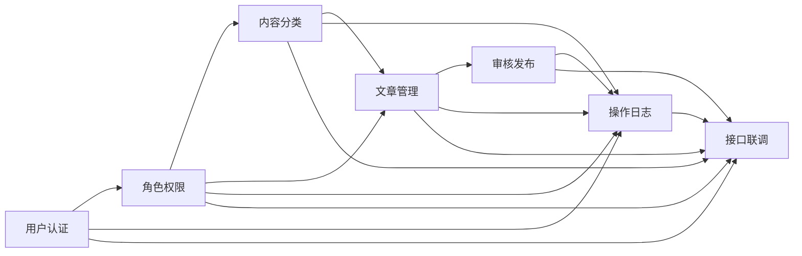

# CMS 模块详细需求索引

本目录是《企业级 CMS 内容管理系统需求分析》V1.2 的模块级补充。总需求文档负责项目范围、角色、总体流程和评分追踪；本目录负责说明每个模块的具体业务规则、输入输出、异常场景和验收标准。

A 模块的组件、分层、接口、事务和并发设计见[A 模块架构设计](../../design/A模块架构设计.md)，字段、约束、索引和迁移设计见[A 模块数据库设计](../../design/A模块数据库设计.md)。A、B 共用的身份上下文、响应结构、错误语义、权限编码和包边界见[B 模块公共契约](../../design/B模块公共契约.md)；B 的用户、角色、权限、关联关系和操作日志字段、约束及索引见[B 模块数据库设计](../../design/B模块数据库设计.md)。

| 模块 | 负责人 | 文档 |
| --- | --- | --- |
| 用户认证与账号管理 | B | [01 用户认证与账号管理](01用户认证与账号管理.md) |
| 角色与权限管理 | B | [02 角色与权限管理](02角色与权限管理.md) |
| 内容分类管理 | A | [03 内容分类管理](03内容分类管理.md) |
| 文章内容管理 | A | [04 文章内容管理](04文章内容管理.md) |
| 审核与发布管理 | A | [05 审核与发布管理](05审核与发布管理.md) |
| 操作日志与公共机制 | B | [06 操作日志与公共机制](06操作日志与公共机制.md) |
| 接口联调与交付 | A 与 B | [07 接口联调与交付](07接口联调与交付.md) |

## 通用约定

### 优先级

| 级别 | 含义 |
| --- | --- |
| P0 | 课程 MVP 必须完成，缺失会破坏核心流程或明确评分项 |
| P1 | P0 稳定后实现的体验或证据增强项 |
| P2 | 项目展望，不纳入当前交付承诺 |

### 角色

| 角色 | 简称 | 核心职责 |
| --- | --- | --- |
| 管理员 | ADMIN | 用户、角色、权限、账号状态和日志管理 |
| 内容编辑 | EDITOR | 分类查看、文章创建编辑和提交审核 |
| 审核人员 | REVIEWER | 查看待审文章并通过或退回 |
| 发布人员 | PUBLISHER | 发布审核通过的文章和下架线上文章 |

用户可以拥有多个角色。接口最终判断有效权限，不直接依赖角色名称。

### 统一业务结果

所有模块必须使用统一响应和异常语义：

| 场景 | HTTP 状态 | 说明 |
| --- | --- | --- |
| 参数格式或校验失败 | 400 | 请求无法进入业务处理 |
| 未登录或会话失效 | 401 | 需要重新登录 |
| 已登录但缺少权限 | 403 | 当前身份不能执行操作 |
| 业务对象不存在或不可见 | 404 | 不泄露无权限对象是否真实存在 |
| 状态、版本或唯一约束冲突 | 409 | 客户端应刷新或修改请求 |
| 未知服务端异常 | 500 | 返回请求标识，不返回内部堆栈 |

### 通用数据规则

- 主键类型、时间格式、逻辑删除字段和公共审计字段由数据库设计统一确定。
- 创建人、更新人、审核人和操作人从服务端登录上下文获取。
- 列表查询默认不返回逻辑删除记录。
- 客户端不能通过通用编辑接口直接修改账号状态、文章状态或权限关系。
- 排序字段必须映射到服务端白名单，不能直接拼接客户端输入。
- 涉及批量写入和多表更新的操作必须定义事务边界和失败语义。

### 需求变更规则

模块负责人修改状态、权限、接口字段或异常语义时，应同时更新：

1. 对应模块需求文档。
2. ApiFox 接口及示例。
3. 相关测试用例。
4. 数据字典或状态图。
5. 调用方代码和联调记录。

## 模块依赖关系

依赖表示联调关系，不表示后置模块必须等待所有前置模块完成。A 可以使用 B 提供的临时接口并行开发，但合入主分支前必须接入真实登录上下文、权限切面和日志机制。
