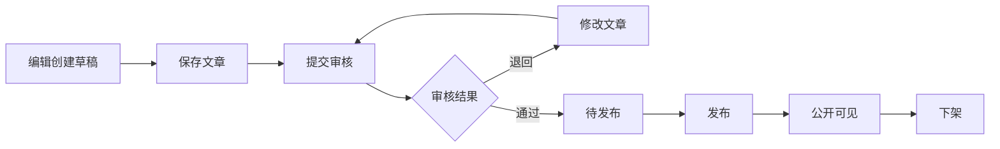

# 企业级 CMS 内容管理系统需求分析

| 项目 | 内容 |
| --- | --- |
| 文档版本 | V1.2 |
| 编制日期 | 2026-09-14 |
| 项目名称 | enterprise-cms |
| 项目性质 | 《JAVA框架技术（一）》课程项目 |
| 技术基线 | SSM 与 MyBatis-Plus |
| 文档状态 | 课程 MVP 需求基线，待小组确认 |
| 适用对象 | 项目成员、指导教师、测试与答辩人员 |

## 1 文档目的

本文在原企业级 CMS 通用需求分析的基础上，根据课程评分表重新确定首期范围。系统保留企业内容管理的基本业务特征，但不在两人课程项目中实现完整的多站点、动态内容模型、复杂工作流和数字资产平台。

本阶段以可运行、可测试、可演示为目标，完成“用户登录 -> 创建文章 -> 分类绑定 -> 提交审核 -> 审核通过 -> 发布或下架 -> 查询操作日志”的核心闭环，并通过权限控制、统一异常、数据校验和 SQL 优化体现 SSM 项目的工程化能力。

文中的“必须”表示课程 MVP 的验收要求，“可选”表示仅在必做功能稳定后实现的扩展能力。本文描述的是计划需求，不代表功能已经完成。

## 2 项目背景与目标

### 2.1 项目背景

企业网站通常需要不同人员共同完成内容编辑、审核和发布。如果缺少统一系统，容易出现文章分类混乱、权限边界不清、未经审核直接发布、操作无法追溯和查询效率低等问题。

本项目建设一个面向企业内容运营场景的 CMS，用于统一管理账号、角色、权限、内容分类、文章、审核状态和操作日志。系统采用 SSM 与 MyBatis-Plus，重点验证分层设计、数据库关联、持久层能力、Spring AOP 权限校验、RESTful 接口和异常处理。

### 2.2 建设目标

1. 建立用户、角色和权限体系，使不同岗位只能执行被授权的操作。
2. 建立多级内容分类，支持分类维护和文章归类。
3. 建立文章从草稿、审核到发布和下架的完整生命周期。
4. 提供分页、模糊检索、多条件筛选、排序和批量发布能力。
5. 记录关键业务操作，保证重要变更可以追溯。
6. 统一接口响应、参数校验和异常处理，提高系统可维护性。
7. 应用 MyBatis-Plus 高级特性并完成一个真实的 N+1 查询优化案例。

### 2.3 成功标准

- 应用可以根据部署说明从空数据库启动。
- 管理员、编辑、审核人员和发布人员的权限边界可以通过接口验证。
- 文章核心流程能够重复演示，不依赖手工修改数据库。
- 非法状态转换、越权访问和错误参数会被服务端拒绝。
- 核心接口具备 ApiFox 请求、响应和异常用例记录。
- SQL 脚本、设计图、接口文档、测试记录和开发过程材料完整。

## 3 需求范围

### 3.1 课程 MVP 必做范围

| 模块 | 必做能力 |
| --- | --- |
| 用户认证 | 注册、登录、退出、账号状态校验 |
| 角色权限 | 角色分配、权限配置、Spring AOP 接口权限校验 |
| 内容分类 | 多级分类新增、编辑、移动、排序、启停和删除限制 |
| 文章管理 | 新增、编辑、详情、逻辑删除、分页查询、多条件模糊检索 |
| 审核发布 | 提交审核、审核通过、审核退回、批量发布和下架 |
| 系统运维 | 操作日志、安全防护、统一异常和请求参数校验 |
| 数据处理 | 分页、筛选、排序、批量处理、逻辑删除和自动填充 |
| 持久层 | MyBatis-Plus 实际应用、N+1 查询优化和必要索引 |
| 接口交付 | RESTful 接口、统一响应、状态码、提示信息和 ApiFox 联调 |

### 3.2 可选扩展范围

只有在全部必做功能通过后，才按以下顺序考虑扩展：

1. 文章附件上传及引用。
2. 文章状态历史或正文版本历史。
3. 数据看板和简单统计。
4. 定时发布。

### 3.3 本阶段不包含

- 多站点、多租户和跨站点内容复用。
- 动态内容类型和字段设计器。
- 完整数字资产库、恶意文件扫描和图片派生处理。
- 多语言、CDN、搜索引擎和外部渠道分发。
- 多级会签、条件分支和可视化流程设计器。
- 已发布正文与新草稿正文同时存在的复杂版本模型。
- 分布式任务调度、跨地域容灾和大规模生产容量承诺。

这些能力可以保留在项目展望中，但不能影响课程 MVP 的交付。

## 4 用户角色与权限

### 4.1 角色定义

| 角色 | 主要职责 | 典型权限 |
| --- | --- | --- |
| 管理员 | 管理用户、角色、权限和账号状态 | 用户管理、角色分配、权限配置、日志查询 |
| 内容编辑 | 创建和维护文章并提交审核 | 分类查看、文章新增、编辑、查询、删除、提交 |
| 审核人员 | 处理待审核文章 | 文章查看、审核通过、审核退回 |
| 发布人员 | 发布已审核文章或执行下架 | 文章查看、批量发布、下架 |

一个用户可以具有多个角色，有效权限为其所有有效角色权限的合集。演示环境允许管理员同时拥有全部权限，其他角色遵循最小权限原则。

### 4.2 权限规则

1. 权限必须在服务端校验，页面隐藏按钮不能代替接口权限控制。
2. 注册账号只能获得系统规定的默认角色，不能通过请求参数注册为管理员。
3. 未登录访问受保护接口返回 401，无权限访问返回 403。
4. 停用账号不能登录；账号停用或权限撤销后的生效时机必须明确并可验证。
5. 文章创建人、审核人和操作人从登录上下文获取，不能由客户端任意指定。
6. 管理权限的分配接口本身也必须受权限保护。

建议统一使用以下权限编码：

| 权限编码 | 用途 |
| --- | --- |
| `cms:user:read` | 查询用户 |
| `cms:user:manage` | 管理用户及账号状态 |
| `cms:role:assign` | 分配用户角色 |
| `cms:permission:manage` | 配置角色权限 |
| `cms:category:read` | 查询分类 |
| `cms:category:manage` | 维护分类 |
| `cms:article:read` | 查询文章 |
| `cms:article:create` | 新增文章 |
| `cms:article:edit` | 编辑文章 |
| `cms:article:delete` | 删除文章 |
| `cms:article:submit` | 提交审核 |
| `cms:article:audit` | 审核通过或退回 |
| `cms:article:publish` | 发布文章 |
| `cms:article:offline` | 下架文章 |
| `cms:log:read` | 查询操作日志 |

## 5 核心业务流程

### 5.1 标准文章流程

### 5.2 文章状态

课程 MVP 使用单一文章状态机，避免文章状态、版本状态和发布状态互相矛盾。

| 状态 | 含义 | 允许的后续操作 |
| --- | --- | --- |
| `DRAFT` | 草稿 | 编辑、删除、提交审核 |
| `PENDING` | 审核中 | 审核通过、审核退回 |
| `REJECTED` | 已退回 | 编辑、删除、重新提交 |
| `APPROVED` | 审核通过 | 发布 |
| `PUBLISHED` | 已发布 | 下架 |
| `OFFLINE` | 已下架 | 可按约定重新编辑形成草稿 |

### 5.3 状态约束

1. 新建文章的初始状态为 `DRAFT`。
2. 只有 `DRAFT` 或 `REJECTED` 状态允许编辑正文。
3. 只有 `DRAFT` 或 `REJECTED` 状态允许提交审核。
4. 只有 `PENDING` 状态允许审核通过或退回。
5. 审核退回必须填写退回原因。
6. 只有 `APPROVED` 状态允许发布。
7. 只有 `PUBLISHED` 状态允许下架。
8. 已发布文章必须先下架，才能继续编辑或删除。
9. Controller 不得直接更新状态；所有状态变化通过文章生命周期服务执行。
10. 状态更新必须同时校验当前状态和乐观锁版本号，重复或并发操作返回 409。

### 5.4 批量发布规则

课程 MVP 采用整批原子策略：

- 单次批量数量设置上限，建议不超过 50 条。
- 发布前校验全部文章是否存在、是否为 `APPROVED`、当前用户是否有发布权限。
- 全部校验通过后在同一事务中完成发布。
- 任意一项校验失败或执行异常时，整批不生效，并返回失败文章及原因。
- 同一请求重复执行时，不得把非法状态误判为发布成功。

## 6 功能需求

本节定义模块级功能基线。更详细的参与角色、业务规则、异常场景、权限和验收标准见[CMS 模块详细需求索引](requirements/modules/README.md)。

### 6.1 用户认证与账号管理

| 编号 | 优先级 | 需求 | 验收标准 |
| --- | --- | --- | --- |
| AUTH-01 | P0 | 用户注册 | 校验必填项和用户名唯一性；不能指定管理员角色 |
| AUTH-02 | P0 | 用户登录 | 密码正确且账号有效时建立会话；错误信息不泄露密码信息 |
| AUTH-03 | P0 | 用户退出 | 当前会话失效，后续请求不能继续访问受保护接口 |
| AUTH-04 | P0 | 账号管理 | 支持分页查询和启停；停用账号不能继续登录 |
| AUTH-05 | P0 | 密码安全 | 密码使用不可逆的安全摘要保存，不保存明文或可逆密文 |

### 6.2 角色与权限管理

| 编号 | 优先级 | 需求 | 验收标准 |
| --- | --- | --- | --- |
| RBAC-01 | P0 | 管理角色与权限 | 角色编码和权限编码唯一，可查询角色权限集合 |
| RBAC-02 | P0 | 分配用户角色 | 非管理员调用被拒绝；重复关系不会重复写入 |
| RBAC-03 | P0 | 配置角色权限 | 非管理员调用被拒绝；非法权限 ID 被校验 |
| RBAC-04 | P0 | AOP 权限校验 | 使用自定义权限注解和 Spring AOP 拦截受保护接口 |
| RBAC-05 | P0 | 当前用户信息 | 可查询当前用户及有效权限，不返回密码摘要 |

### 6.3 内容分类管理

| 编号 | 优先级 | 需求 | 验收标准 |
| --- | --- | --- | --- |
| CAT-01 | P0 | 分类树查询 | 一次查询或批量组装分类树，不产生逐节点 N+1 查询 |
| CAT-02 | P0 | 新增和编辑分类 | 校验名称、父分类、排序和状态 |
| CAT-03 | P0 | 移动分类 | 禁止将分类移动到自身或其后代节点下 |
| CAT-04 | P0 | 分类排序和启停 | 排序结果稳定；停用分类不能绑定新文章 |
| CAT-05 | P0 | 删除分类 | 有子分类或有效文章引用时拒绝删除 |
| CAT-06 | P0 | 文章分类绑定 | 文章只能绑定存在且有效的分类 |

### 6.4 文章内容管理

| 编号 | 优先级 | 需求 | 验收标准 |
| --- | --- | --- | --- |
| ARTICLE-01 | P0 | 新增文章 | 创建为草稿，作者来自登录上下文，字段校验有效 |
| ARTICLE-02 | P0 | 编辑文章 | 仅允许合法状态编辑；通过版本号检测并发覆盖 |
| ARTICLE-03 | P0 | 文章详情 | 返回文章、分类和必要的作者信息，不泄露内部敏感字段 |
| ARTICLE-04 | P0 | 逻辑删除 | 删除后普通查询不可见；已发布文章不能直接删除 |
| ARTICLE-05 | P0 | 分页查询 | 使用数据库分页，返回总数、页码、页大小和列表 |
| ARTICLE-06 | P0 | 多条件检索 | 支持标题模糊匹配、分类、状态、作者和时间范围筛选 |
| ARTICLE-07 | P0 | 多维排序 | 排序字段使用白名单，默认使用稳定次排序字段 |
| ARTICLE-08 | P0 | 富文本安全 | 保存或输出时采用明确的脚本注入防护策略 |

### 6.5 审核与发布

| 编号 | 优先级 | 需求 | 验收标准 |
| --- | --- | --- | --- |
| FLOW-01 | P0 | 提交审核 | 只接受草稿或退回文章，提交后不能直接编辑 |
| FLOW-02 | P0 | 待审查询 | 审核人员可以分页查询待审核文章 |
| FLOW-03 | P0 | 审核通过 | 只接受审核中状态，记录审核人和时间 |
| FLOW-04 | P0 | 审核退回 | 必须填写原因，文章进入退回状态 |
| PUB-01 | P0 | 批量发布 | 仅发布审核通过文章，符合整批事务规则 |
| PUB-02 | P0 | 下架文章 | 已发布文章下架后不再被公开查询接口返回 |
| PUB-03 | P0 | 状态冲突处理 | 重复、越权和并发操作不会产生非法最终状态 |

### 6.6 操作日志与公共机制

| 编号 | 优先级 | 需求 | 验收标准 |
| --- | --- | --- | --- |
| OPS-01 | P0 | 操作日志 | 记录操作者、模块、动作、目标、时间、结果和必要摘要 |
| OPS-02 | P0 | 日志查询 | 支持分页、操作者、动作类型和时间范围筛选 |
| OPS-03 | P0 | 敏感信息保护 | 日志和接口均不输出密码摘要、会话标识或完整敏感请求体 |
| OPS-04 | P0 | 统一异常 | 统一处理校验失败、未登录、无权限、不存在、冲突和未知异常 |
| OPS-05 | P0 | 参数校验 | 校验 ID、文本长度、分页范围、批量大小、排序字段和审核意见 |
| OPS-06 | P0 | 统一响应 | 返回统一业务码、提示信息、数据和请求标识 |

### 6.7 RESTful 接口与联调

| 编号 | 优先级 | 需求 | 验收标准 |
| --- | --- | --- | --- |
| API-01 | P0 | RESTful 接口 | 资源路径、HTTP 方法和状态码语义一致 |
| API-02 | P0 | 接口文档 | 说明参数、权限、正常响应和错误响应 |
| API-03 | P0 | ApiFox 联调 | 核心接口保存可重复执行的正常和异常用例 |
| API-04 | P0 | HTTP 状态 | 未登录 401、无权限 403、不存在 404、状态冲突 409 |

## 7 数据与业务对象概述

本节只确定业务对象及关系，具体字段、外键、索引和建表 SQL 在数据库设计阶段完成。

| 业务对象 | 说明 | 主要关系 |
| --- | --- | --- |
| 用户 | 系统登录账号 | 用户与角色多对多；用户是文章作者和日志操作者 |
| 角色 | 一组岗位权限 | 角色与用户、权限多对多 |
| 权限 | 接口操作能力 | 由角色获得，通过 AOP 校验 |
| 分类 | 多级内容分类 | 分类自关联；一个分类包含多篇文章 |
| 文章 | CMS 核心内容 | 关联分类和作者，保存审核发布状态 |
| 操作日志 | 关键操作记录 | 关联操作者，通过目标类型和目标 ID 标识业务对象 |
| 状态历史 | 可选的文章流转记录 | 关联文章、操作者、原状态和新状态 |

数据库设计必须至少覆盖评分表要求的用户、角色、权限、文章、分类和日志六类业务表，并根据多对多关系增加用户角色、角色权限关联表。

## 8 非功能需求

### 8.1 安全性

- 密码不得明文保存或写入日志。
- 所有数据库查询使用参数绑定；动态排序字段使用白名单。
- 服务端校验登录状态、权限和文章状态。
- 富文本内容必须防止存储型脚本注入。
- 接口异常不得向客户端返回数据库语句、文件路径或完整堆栈。

### 8.2 健壮性

- Controller、Service 和 Mapper 职责清晰。
- 多表状态变化定义事务边界，异常时不保留部分业务结果。
- 对不存在记录、重复操作、非法状态、越权和并发修改提供明确结果。
- 批量操作限制单次数量，防止超大请求影响系统稳定。

### 8.3 性能

- 列表查询必须使用数据库分页。
- 文章列表关联分类、用户列表关联角色时不得逐条查询。
- 常用筛选和关联字段根据真实查询建立索引。
- 至少保留一个 N+1 优化前后的 SQL 次数、正确性和执行结果对比。
- 性能数据必须来自实际测试，不预先承诺未经验证的企业级容量指标。

### 8.4 可维护性

- 使用统一命名、返回结构、错误码和权限编码。
- 使用 DTO 接收请求、VO 返回结果，避免直接暴露 Entity。
- 数据库脚本、接口文档和代码同步维护。
- 关键业务逻辑具备必要注释，但不使用注释重复表达代码本身。

## 9 模块分工与协作边界

### 9.1 A 模块

A 负责内容领域，代码和数据所有权包括：

- 内容分类的 Controller、Service、Mapper、DTO、VO。
- 文章的 Controller、Service、Mapper、DTO、VO。
- 文章生命周期服务，包括提交、审核、发布和下架的状态转换。
- 分页、多条件检索、排序、逻辑删除、自动填充和乐观锁。
- 文章与分类相关的 N+1 检查、ApiFox 用例和模块文档。

A 维护 `cms_category`、`cms_article`，以及可选的文章状态历史表。

### 9.2 B 模块

B 负责身份与公共能力，代码和数据所有权包括：

- 用户、角色、权限和关联关系管理。
- 注册、登录、退出和当前用户上下文。
- Spring AOP 权限注解与权限切面。
- 操作日志注解、切面和日志查询。
- 统一响应、统一异常和公共校验约定。
- 用户角色查询的 N+1 优化、ApiFox 用例和模块文档。

B 维护 `sys_user`、`sys_role`、`sys_permission`、用户角色表、角色权限表和 `sys_operation_log`。

### 9.3 协作规则

1. A 使用 B 提供的当前用户上下文、权限注解和日志注解。
2. B 开发的审核页面只能调用 A 的状态接口，不直接修改文章表。
3. 同一业务规则只有一个后端实现入口。
4. 修改公共 DTO、错误码、权限编码和数据库公共字段前必须同步。
5. 数据库迁移脚本按编号管理，禁止双方无沟通修改同一个历史脚本。
6. 双方分别负责自己模块的实现、异常处理、测试和文档。
7. 每完成一个核心接口立即更新 ApiFox，并尽早联调主流程。

## 10 验收场景

| 编号 | 场景 | 预期结果 |
| --- | --- | --- |
| AT-01 | 普通用户注册时提交管理员角色 | 注册成功但不会获得管理员权限 |
| AT-02 | 停用账号登录 | 登录被拒绝 |
| AT-03 | 编辑用户直接调用角色分配或审核接口 | Spring AOP 返回 403 |
| AT-04 | 创建多级分类并调整排序 | 分类树层级和顺序正确 |
| AT-05 | 将分类父级改为自身或后代 | 操作被拒绝，原结构不变 |
| AT-06 | 删除有子分类或文章引用的分类 | 操作被拒绝并返回明确原因 |
| AT-07 | 创建文章并执行分页和多条件检索 | 数据、总数、筛选和排序正确 |
| AT-08 | 两次使用同一旧版本号保存文章 | 后一次返回 409，不覆盖新数据 |
| AT-09 | 草稿文章直接发布 | 状态校验失败 |
| AT-10 | 提交、退回、修改、重新提交和通过 | 状态及审核信息正确 |
| AT-11 | 批次中包含非审核通过文章 | 整批不生效并返回失败原因 |
| AT-12 | 发布文章后通过公开接口查询 | 仅已发布文章可见 |
| AT-13 | 下架文章后再次公开查询 | 已下架文章不可见 |
| AT-14 | 执行关键业务操作后查询日志 | 操作者、动作、目标和结果正确且无敏感信息 |
| AT-15 | 传入非法分页或排序参数 | 请求被拒绝，不暴露异常堆栈 |
| AT-16 | 查询用户及其角色或文章及其分类 | 不产生逐条关联查询的 N+1 问题 |
| AT-17 | 从空数据库导入 SQL 并启动应用 | 可按部署说明完成核心流程 |

## 11 课程评分需求追踪

| 评分项 | 本文对应内容 | 计划证据 |
| --- | --- | --- |
| 需求分析 | 第 1 至 10 节 | 本文及修订记录 |
| 六类业务表关联 | 第 7 节 | 后续数据库设计、E-R 图和 SQL |
| 架构图、E-R 图、流程图 | 第 5、7 节 | 后续设计图文件 |
| 用户权限管理 | 第 4、6.1、6.2 节 | 权限接口、AOP 和测试记录 |
| 内容分类管理 | 第 6.3 节 | 分类接口和异常用例 |
| 文章内容管理 | 第 5、6.4、6.5 节 | 文章接口和生命周期演示 |
| 系统基础运维 | 第 6.6、8.1 节 | 日志、异常和校验结果 |
| 高级数据处理与 MP | 第 6.4、8.3 节 | 分页、逻辑删除、填充和乐观锁代码 |
| SQL 优化 | 第 8.3 节 | N+1 优化前后对比 |
| RESTful 与联调 | 第 6.7 节 | 接口文档和 ApiFox 导出 |
| 代码质量 | 第 8 节 | 代码评审和边界用例 |
| AI 合理应用 | 第 12 节 | 原始交互、人工修改和 Git 历史 |
| 文档与部署 | 第 13 节 | 报告、SQL、接口文档和部署说明 |

## 12 AI 使用与过程记录要求

- AI 只用于需求梳理、基础配置、通用代码片段和接口模板等辅助工作。
- 项目成员必须理解并逐行检查采用的代码。
- 权限规则、状态机、事务、并发处理、排错、SQL 优化和重构必须由成员能够独立解释。
- 保留 AI 原始交互、人工修改说明、错误复现、解决过程、测试结果和关联 Git 提交。
- 不得把未运行的代码描述为已完成，不得编造测试或性能数据。
- 不得直接复制完整 AI 生成项目或来源不明的开源代码。

## 13 交付物

项目最终应提供：

- 可启动的完整源代码和依赖配置。
- 建表、约束、索引和初始化数据 SQL。
- 需求分析、项目架构图、E-R 图、业务流程图和数据字典。
- RESTful 接口文档和 ApiFox 导出文件。
- 功能、权限、异常和 SQL 优化测试记录。
- 结题报告和两名成员的实验总结。
- 环境配置、数据库导入、启动命令和演示账号说明。
- AI 使用记录、人工修改记录、排错材料和 Git 提交历史。

## 14 待确认事项

| 编号 | 待确认问题 | 影响 |
| --- | --- | --- |
| Q-01 | 项目工程的初始化方式和当前可运行状态 | 项目初始化和依赖选择 |
| Q-02 | JDK、Maven、数据库及运行容器版本 | 环境统一和部署说明 |
| Q-03 | 教师是否另有完整后台页面要求 | 前端工作量和演示方式 |
| Q-04 | 登录使用服务端 Session 还是课程指定方案 | 登录上下文与接口测试 |
| Q-05 | 已下架文章重新编辑后的状态规则 | 状态机实现 |
| Q-06 | 是否增加简化的文章状态历史表 | 数据库表和审核记录展示 |
| Q-07 | 项目截止时间和每名成员可投入时间 | 排期和可选范围 |

待确认事项未解决前，可以进行数据库与接口草案设计，但不能将对应方案描述为教师已经确认的要求。

## 15 后续设计顺序

需求基线确认后，按照课程评分表顺序继续完成：

1. 数据库架构设计和数据字典。
2. 项目架构图、数据库 E-R 图和业务流程图。
3. 企业级目录分层和基础工程结构。
4. 用户权限、分类、文章、审核发布及系统运维功能。
5. MyBatis-Plus、高级查询、批量处理和 SQL 优化。
6. ApiFox 联调、测试、报告、部署和答辩材料。
